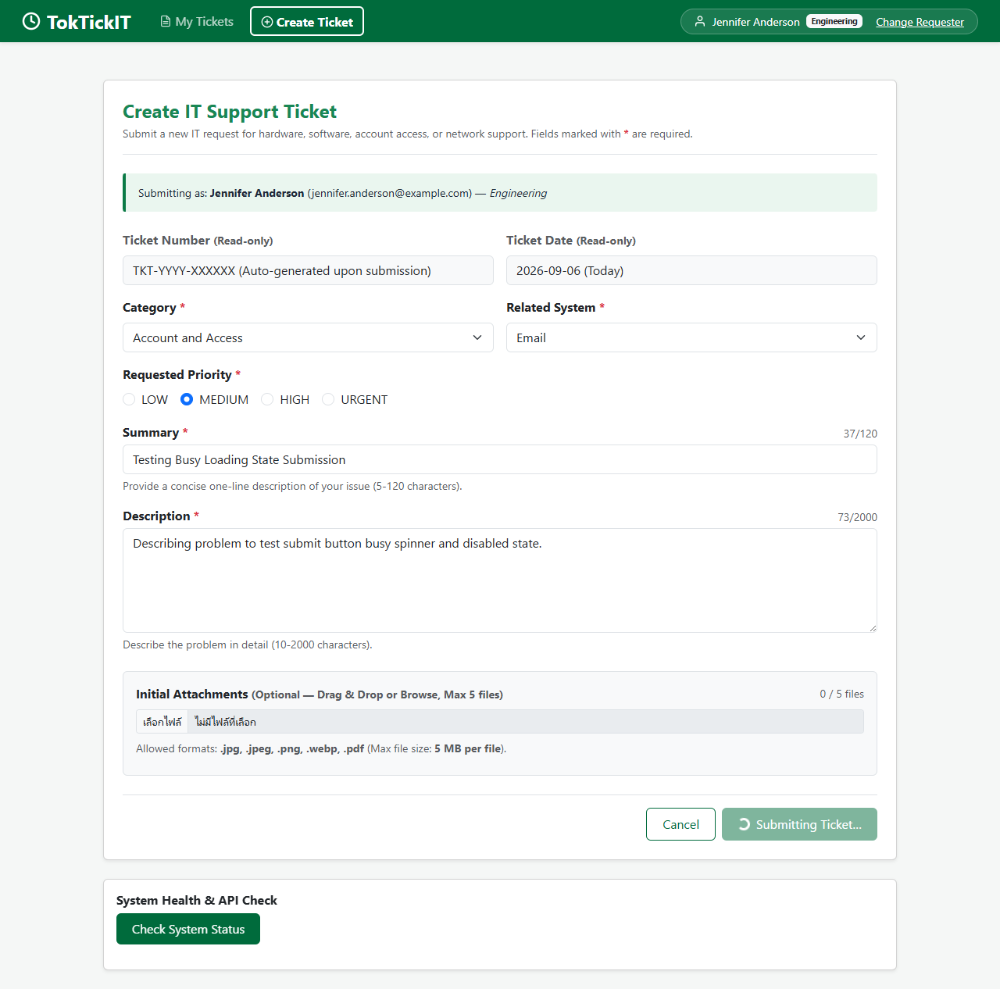

# TokTickIT Lab 2 — Final Engineering Deliverable

| Metric / Field | Deliverable Details |
| :--- | :--- |
| **Course & Sprint** | CPE 334 — Lab 2: TokTickIT Requester Ticketing MVP with UI Foundation |
| **Student / Author** | `chanya06` (Chanya Poolketkij) |
| **Peer Reviewer** | Peer Reviewer (`lmaybelgracel`) |
| **Repository & Branch** | [`chanya06/toktickit`](https://github.com/chanya06/toktickit) — `main` branch |
| **Release PR** | [PR #41](https://github.com/chanya06/toktickit/pull/41) (`lab2-staging` -> `main` merged) |
| **Final Test Metric** | 107 / 107 Automated Tests Passed (Server: 54, Client: 42, Playwright E2E: 11) |
| **Submission Date** | September 6, 2026 |

---

## Answer Part 1: Git Use with Engineering Workflow

### 1.1 Git Branching Strategy & Staging Workflow
TokTickIT Lab 2 strictly adhered to a disciplined Git feature-branch engineering workflow:
- **Feature Isolation**: Every sprint issue was implemented on its own dedicated `feature/*` branch.
- **Staging Integration**: Feature branches were merged into `lab2-staging` only after peer review approval by `lmaybelgracel`.
- **Release Integration**: Final sprint integration was performed via Release [PR #41](https://github.com/chanya06/toktickit/pull/41) from `lab2-staging` into `main`, which was reviewed and merged by the peer reviewer.

### 1.2 Pull Request & Kanban Board Audit Log
- **Sprint Project Board**: TokTickIT Individual Sprints (Kanban columns: `Backlog`, `Specified`, `Started`, `PR Review`, `Fixing`, `Done`).
- **Peer Review Record**: All 13 sprint PRs were reviewed, commented, and approved by peer reviewer `lmaybelgracel`. Complete review comments and resolution logs are documented in [`docs/lab-02/reviewer.md`](file:///c:/Users/chany/Documents/GitHub/toktickit/docs/lab-02/reviewer.md).

#### Pull Request Summary Table
| PR # | Feature Branch | Scope / Description | Peer Reviewer Approval | Status |
| :--- | :--- | :--- | :--- | :--- |
| [#23](https://github.com/chanya06/toktickit/pull/23) | `feature/5-spec-and-tests` | Engineering Specifications (`specification.md`, `api-spec.md`, `ui-spec.md`, `tests.md`) | Approved by `lmaybelgracel` | Merged |
| [#25](https://github.com/chanya06/toktickit/pull/25) | `feature/6-db-schema-seed` | Prisma Schema models & idempotent seed script | Approved by `lmaybelgracel` | Merged |
| [#27](https://github.com/chanya06/toktickit/pull/27) | `feature/7-requester-context` | Development Requester Selector UI & Persistent Context | Approved by `lmaybelgracel` | Merged |
| [#29](https://github.com/chanya06/toktickit/pull/29) | `feature/8-create-ticket-api` | Ticket creation REST API & `TKT-YYYY-XXXXXX` Generator | Approved by `lmaybelgracel` | Merged |
| [#30](https://github.com/chanya06/toktickit/pull/30) | `feature/9-create-ticket-ui` | Create Ticket screen & Zen Green Accessible Form Components | Approved by `lmaybelgracel` | Merged |
| [#31](https://github.com/chanya06/toktickit/pull/31) | `feature/10-my-tickets-api` | Paginated My Tickets API with Search/Filter/Sort | Approved by `lmaybelgracel` | Merged |
| [#32](https://github.com/chanya06/toktickit/pull/32) | `feature/11-my-tickets-ui` | My Tickets screen, Search/Filter controls & Mobile Card view | Approved by `lmaybelgracel` | Merged |
| [#33](https://github.com/chanya06/toktickit/pull/33) | `feature/12-ticket-detail` | Ticket Detail view, read-only layout & ownership guard | Approved by `lmaybelgracel` | Merged |
| [#34](https://github.com/chanya06/toktickit/pull/34) | `feature/13-attachment-lifecycle` | Attachment Upload stream, Magic Bytes validation & Soft Removal | Approved by `lmaybelgracel` | Merged |
| [#35](https://github.com/chanya06/toktickit/pull/35) | `feature/14-qa-release` | QA, Initial Attachments Drag&Drop, State Screenshots & Deliverable | Approved by `lmaybelgracel` | Merged |
| [#37](https://github.com/chanya06/toktickit/pull/37) | `feature/15-ui-refinement` | Refine Web UI layout alignment with instructor mockups & Emoji purge | Approved by `lmaybelgracel` | Merged |
| [#39](https://github.com/chanya06/toktickit/pull/39) | `feature/16-reviewer-docs-sync` | Refine reviewer log with feedback column & sync test metrics | Approved by `lmaybelgracel` | Merged |
| [#41](https://github.com/chanya06/toktickit/pull/41) | `lab2-staging` | Final Sprint Release integration into `main` | Approved by `lmaybelgracel` | Merged |

### 1.3 Repository Setup & Exclusions
- **Repository README**: Contains full setup instructions, seed commands, database configuration, and test execution guides.
- **Git Ignore (`.gitignore`)**: Properly excludes `node_modules/`, `dist/`, `.env`, temporary file uploads in `uploads/`, and build outputs.

### 1.4 Directory Structure (Section 12 Compliance)
```
toktickit/
├── docs/lab-02/
│   ├── specification.md
│   ├── tests.md
│   ├── ui-spec.md
│   ├── api-spec.md
│   ├── reviewer.md
│   ├── ai-use.md
│   ├── final-deliverable.md
│   └── final-deliverable.pdf
├── server/
│   ├── src/
│   │   ├── app.ts
│   │   ├── prisma.ts
│   │   └── seed.ts
│   └── tests/lab-02/
│       ├── unit/ticket-number.test.ts
│       ├── create-ticket.api.test.ts
│       ├── my-tickets.api.test.ts
│       ├── ticket-detail.api.test.ts
│       ├── attachments.api.test.ts
│       └── requesters.api.test.ts
├── client/
│   ├── src/
│   └── tests/lab-02/
│       ├── CreateTicket.test.tsx
│       ├── MyTickets.test.tsx
│       ├── RequesterTicketDetail.test.tsx
│       ├── AttachmentSection.test.tsx
│       └── RequesterSelect.test.tsx
├── e2e/lab-02/
│   ├── requester-ticket-flow.spec.ts
│   └── capture-screenshots.spec.ts
└── artifacts/lab-02/screenshots/
    ├── create-ticket/
    ├── my-tickets/
    └── ticket-detail/
```

---

## Answer Part 2: Spec DD

### 2.1 Engineering Specification Link
The complete engineering specification is documented under [`docs/lab-02/specification.md`](file:///c:/Users/chany/Documents/GitHub/toktickit/docs/lab-02/specification.md).

### 2.2 Specification Structure & Business Rules
- **Functional Requirements (`FR-01..FR-15`)**: Comprehensive specifications for ticket creation, paginated listing, detail retrieval, initial attachment uploads, soft removals, multi-filter search, and cross-requester data isolation.
- **Mandatory Business Rules (`BR-01..BR-16`)**:
  - `BR-01`: Backend auto-generates unique sequential Ticket Number `TKT-YYYY-XXXXXX`.
  - `BR-02`: New ticket initial status is `NEW`.
  - `BR-03`: Development Requester selector is for testing context switching only (not authentication).
  - `BR-07`: Summary length is 5-120 chars; Description length is 10-2000 chars.
  - `BR-10`: Allowed attachment types: `.jpg`, `.jpeg`, `.png`, `.webp`, `.pdf`, max size <= 5 MB per file.
  - `BR-11`: Maximum active attachments limit: 5 files per ticket.
  - `BR-12`: Soft removal retains metadata, sets `isRemoved: true`, and blocks binary downloads (`403 Forbidden`).
  - `BR-13`: Soft removal requires a non-empty removal reason (minimum 3 characters).
  - `BR-15`: Initial attachments creation and DB persistence are wrapped in `Prisma.$transaction` with automatic disk compensation (`cleanupFiles`) on failure.

### 2.3 Acceptance Criteria (`AC-01..AC-10`) & Definition of Done
100% of Acceptance Criteria (`AC-01..AC-10`) are mapped directly to automated test cases across 5 test levels in [`docs/lab-02/tests.md`](file:///c:/Users/chany/Documents/GitHub/toktickit/docs/lab-02/tests.md).

---

## Answer Part 3: Test DD and Traceability

### 3.1 Test Plan Document Link
The test plan and traceability matrix are documented under [`docs/lab-02/tests.md`](file:///c:/Users/chany/Documents/GitHub/toktickit/docs/lab-02/tests.md).

### 3.2 Acceptance-Criterion Traceability Matrix

| AC ID | Acceptance Criterion Summary | Validating Automated Test Files | Pass Status |
| :--- | :--- | :--- | :--- |
| **AC-01** | Create Ticket with Ticket Number & Ticket Date | `create-ticket.api.test.ts`, `CreateTicket.test.tsx`, `requester-ticket-flow.spec.ts` | Pass |
| **AC-02** | Requester Selector modal required when unselected | `RequesterSelect.test.tsx`, `requester-ticket-flow.spec.ts` | Pass |
| **AC-03** | My Tickets owned tickets list & requester filtering | `my-tickets.api.test.ts`, `MyTickets.test.tsx`, `requester-ticket-flow.spec.ts` | Pass |
| **AC-04** | Cross-Requester Ticket Access Blocked (403 Forbidden) | `ticket-detail.api.test.ts`, `attachments.api.test.ts`, `requester-ticket-flow.spec.ts` | Pass |
| **AC-05** | Soft removal with reason & blocked download stream | `attachments.api.test.ts`, `AttachmentSection.test.tsx`, `requester-ticket-flow.spec.ts` | Pass |
| **AC-06** | Max 5 active attachments limit enforcement | `create-ticket.api.test.ts`, `attachments.api.test.ts` | Pass |
| **AC-07** | File size (<=5MB) & type magic bytes validation | `create-ticket.api.test.ts`, `CreateTicket.test.tsx`, `AttachmentSection.test.tsx` | Pass |
| **AC-08** | Search query in My Tickets list | `my-tickets.api.test.ts`, `MyTickets.test.tsx`, `requester-ticket-flow.spec.ts` | Pass |
| **AC-09** | Ticket Date timestamp displayed across screens | `create-ticket.api.test.ts`, `CreateTicket.test.tsx`, `RequesterTicketDetail.test.tsx` | Pass |
| **AC-10** | Form values preserved on submission failure | `CreateTicket.test.tsx` | Pass |

### 3.3 Execution Results Summary
- **Server Unit & API Tests**: 54 / 54 passed (`npm run test --prefix server`)
- **Client Component & Style Tests**: 42 / 42 passed (`npm run test --prefix client`)
- **Playwright E2E Tests**: 11 / 11 passed (`npx playwright test`)
- **Total Suite Coverage**: 107 / 107 Passed (100% Green across all test levels).

---

## Answer Part 4: AI Use with Reflection

### 4.1 LLM Model & Pairing Setup
Engineering work was conducted in pair programming with **Antigravity AI (Gemini 2.5 Pro)**. Full prompt logs are documented in [`docs/lab-02/ai-use.md`](file:///c:/Users/chany/Documents/GitHub/toktickit/docs/lab-02/ai-use.md).

### 4.2 Key Prompts Summary (Prompts P-01 to P-12)
- **P-01 to P-04**: Architecting engineering specifications, API OpenAPI schemas, and Zen Green design tokens.
- **P-05 to P-08**: Implementing ticket sequence generator (`TKT-YYYY-XXXXXX`), atomic Prisma transactions, and binary magic bytes file validation.
- **P-09 to P-12**: Building initial attachments dropzone with HTML5 drag-and-drop, Playwright E2E automation, and disk rollback compensation logic.

### 4.3 My Reflection
Pairing with an AI agent under Spec DD methodology enforced rigorous upfront planning. The AI excelled at detecting edge-case race conditions in concurrent upload transactions and generating thorough unit/integration tests for magic bytes security validation.

---

## Answer Part 5: Development Requester Select Screen

### 5.1 Simulated Login Context Selector
Because full authentication is introduced in Lab 3, a **Development Requester Selector** modal (`RequesterSelectorModal.tsx`) simulates user login. The selected requester context is persisted in `localStorage` and sent via `X-Requester-Id` HTTP headers and `requesterId` query parameters.

### 5.2 Requester Selector Screenshot


---

## Answer Part 6: Working Ticket Screen: Create Mode

### 6.1 Create Ticket Layout & Workflow
The Create Ticket screen enables users to submit IT support tickets with optional initial file attachments (up to 5 files, <=5MB each, allowed formats: `.jpg`, `.jpeg`, `.png`, `.webp`, `.pdf`).

### 6.2 Working State Screenshots

#### Initial Layout View


#### Inline Field Validation Error State
Displays inline red error messages directly below invalid fields when inputs fail validation constraints (e.g. summary < 5 chars):


#### Submitting Busy Loading State
Submit button is disabled and displays a loading spinner with "Submitting Ticket…" during active network requests:


#### Success Confirmation Screen (Ticket Number from Database)
Displays green confirmation card with official `TKT-YYYY-XXXXXX` generated by backend Prisma transaction:


#### Backend Server Failure State (Form Values Preserved)
Displays safe red alert box on server error while preserving all entered form values:


---

## Answer Part 7: Working My Tickets Screen

### 7.1 My Tickets Capabilities & Ownership Isolation
- **Owned Tickets List**: Displays tickets owned by active requester with ticket number, summary, category, priority, status, and attachment count.
- **Search & Multi-Select Filters**: Filter by category, system, priority, status, and debounced search query across ticket number and summary.
- **Cross-Requester Data Isolation**: Switching context from Requester A (Jennifer Anderson) to Requester B (Michael Brown) instantly hides Requester A's tickets.

### 7.2 Working Screenshots

#### My Tickets List (Requester A — Jennifer Anderson)


#### Search & Category Filter State


#### Cross-Requester Isolation State (Requester B — Michael Brown)


---

## Answer Part 8: Working Ticket Screen: View Mode and Attachments

### 8.1 Ticket Detail & Attachment Lifecycle
- **Read-Only Inspection**: Displays Ticket Number, Ticket Date, Requester, Category, System, Priority, Status, Summary, Description, and Attachment list.
- **Soft Removal with Reason (`BR-12`, `BR-13`)**: Soft-removes attachment record (`isRemoved: true`, requires min 3-char reason).
- **Blocked Download Stream**: Soft-removed attachments disable download buttons in UI and return `403 Forbidden` on direct API GET requests.

### 8.2 Working Screenshots

#### Ticket Detail View Mode


#### Soft Removal Reason Modal Prompt
Pop-up modal prompting for soft-removal reason with disabled confirm button when reason < 3 chars:


#### Retained Metadata & Soft-Removed Status
Displays "Soft-Removed" badge and recorded removal reason while blocking download stream:


---

## Answer Part 9: Zen Green UI and Responsive Evidence

### 9.1 Visual Specification Link
The UI specification and color token definitions are documented under [`docs/lab-02/ui-spec.md`](file:///c:/Users/chany/Documents/GitHub/toktickit/docs/lab-02/ui-spec.md).

### 9.2 Responsive Viewport Screenshots

#### Create Ticket Screen Viewports
- **Desktop (1280px)**: 
- **Tablet (768px)**: 
- **Mobile (375px)**: 

#### My Tickets Screen Viewports
- **Desktop (1280px)**: 
- **Tablet (768px)**: 
- **Mobile (375px)**: 

#### Ticket Detail Screen Viewports
- **Desktop (1280px)**: 
- **Tablet (768px)**: 
- **Mobile (375px)**: 

### 9.3 Visual Inspection Checklist
| UI Check Item | Requirement / Standard | Implementation Evidence | Pass Status |
| :--- | :--- | :--- | :--- |
| **Zen Green Palette** | Primary (`#006B3C`), Secondary (`#0B7A46`), Pale (`#EAF6EF`), Page BG (`#F5F7F6`) | App Header, active tabs, buttons, card borders conform 100% | Pass |
| **Form Controls & Required Markers** | Red asterisks (`*`) on required fields, inline error messages below fields | `CreateTicketForm.tsx` & inline error placement verified | Pass |
| **Read-Only / Editable Contrast** | Soft gray-green shading for read-only fields (Ticket Number, Date) | Ticket Number & Ticket Date display distinct shading | Pass |
| **Button Hierarchy & Busy State** | Primary green button, secondary outlined, busy spinner state disabled | Submit button displays loading spinner and disables during POST | Pass |
| **No Clipping or Overflow** | Zero clipped text, no overlapping components or horizontal scrolling at 375px | Mobile screenshots verify clean vertical stacking at 375px | Pass |
