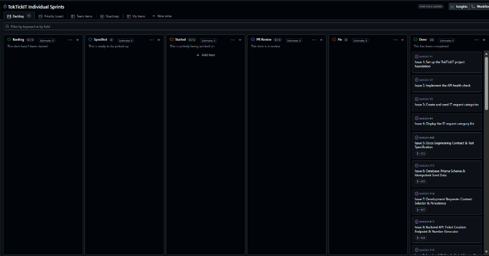

# TokTickIT Lab 3 — Final Engineering Deliverable

| Metric / Field | Deliverable Details |
| :--- | :--- |
| **Course & Sprint** | CPE 334 Software Engineering — Lab 3: TokTickIT Enterprise Roles, IT Staff Operations & Administration |
| **Student / Author** | `chanya06` (Chanya Poolketkij) |
| **Peer Reviewer** | Peer Reviewer (`lmaybelgracel`) |
| **Partner Reviewed by Author** | `titayaaa` |
| **Repository & Branch** | [`chanya06/toktickit`](https://github.com/chanya06/toktickit) — `main` branch |
| **Release PR** | [PR #71](https://github.com/chanya06/toktickit/pull/71) (`lab3-staging` -> `main` merged) |
| **Final Test Metric** | **277 / 277 Automated Tests Passed (100% Pass)** (Server: 149, Client: 116, Playwright E2E: 12) |
| **Build Status** | Clean Production Build (`tsc && vite build`) |
| **Deliverable Date** | October 3, 2026 |

---

## Answer Part 1: Git Use with Engineering Workflow

### 1.1 Git Branching Strategy & Staging Workflow
TokTickIT Lab 3 strictly adhered to a disciplined Git feature-branch engineering workflow:
- **Feature Isolation**: Every sprint issue was implemented on its own dedicated `feature/*` branch.
- **Staging Integration**: Feature branches were merged into `lab3-staging` only after formal peer review approval by `@lmaybelgracel`.
- **Release Integration**: Final sprint integration was performed via Release [PR #71](https://github.com/chanya06/toktickit/pull/71) from `lab3-staging` into `main`, which was reviewed, approved, and merged by the peer reviewer.

### 1.2 Pull Request Traceability Table
All 12 feature branches plus the final release integration PR were formally reviewed, tracked, and approved:

| PR # | Feature Branch | Scope / Description | Reviewer Verdict | Status |
| :--- | :--- | :--- | :--- | :--- |
| [#44](https://github.com/chanya06/toktickit/pull/44) | `feature/17-spec-and-tests` | Sprint 3 Specifications (`specification.md`, `tests.md`, `ui-spec.md`, `api-spec.md`) | Approved | Merged |
| [#57](https://github.com/chanya06/toktickit/pull/57) | `feature/18-db-schema-and-seed` | Prisma Schema models & idempotent seed script | Approved | Merged |
| [#58](https://github.com/chanya06/toktickit/pull/58) | `feature/19-auth-api` | Authentication, Session, and Password Change REST APIs | Approved | Merged |
| [#59](https://github.com/chanya06/toktickit/pull/59) | `feature/20-auth-ui` | Login view, Change Password view, and Role-Aware Header | Approved | Merged |
| [#60](https://github.com/chanya06/toktickit/pull/60) | `feature/21-requester-session` | Requester Session Migration & Resolution Indication Action | Approved | Merged |
| [#61](https://github.com/chanya06/toktickit/pull/61) | `feature/22-staff-queue-api` | IT Staff Ticket Queue REST API (Search, Filter, Sort, Pagination) | Approved | Merged |
| [#62](https://github.com/chanya06/toktickit/pull/62) | `feature/23-staff-queue-ui` | IT Staff Ticket Queue UI & Responsive Mobile Cards | Approved | Merged |
| [#63](https://github.com/chanya06/toktickit/pull/63) | `feature/24-staff-operations` | IT Staff Operations Panel, Claim, IT Priority & Status Transition Matrix | Approved | Merged |
| [#64](https://github.com/chanya06/toktickit/pull/64) | `feature/25-comments-and-notes` | Public Comments & Private Internal Notes Communication Channels | Approved | Merged |
| [#65](https://github.com/chanya06/toktickit/pull/65) | `feature/26-admin-user-management` | Administrator User Management REST APIs & Safety Rules | Approved | Merged |
| [#66](https://github.com/chanya06/toktickit/pull/66) | `feature/27-admin-user-management-ui` | Administrator User Management Directory & Modals | Approved | Merged |
| [#70](https://github.com/chanya06/toktickit/pull/70) | `feature/28-qa-automated-tests-release-integration` | QA Automated E2E Tests, Screen Captures & Release Integration | Approved | Merged |
| [#71](https://github.com/chanya06/toktickit/pull/71) | `lab3-staging` | Release Integration PR into `main` | Approved | Merged |

### 1.3 Git Commit History Evidence (Feature Branches -> Staging -> Main)
The Git commit graph confirms that all 12 sprint feature branches were merged into `lab3-staging` via Pull Requests with formal peer review approval, and the final production release was integrated into `main` via Release [PR #71](https://github.com/chanya06/toktickit/pull/71):

```text
*   2c20a4b Merge pull request #71 from chanya06/lab3-staging (Release Integration)
|\  
| * 33a05c6 docs(lab-03): update DoD checklist, PENDING status badge tokens, README credentials, and ai-use reflection
| * 82d48a1 docs(lab-03): populate complete peer reviews and responses for partner @titayaaa (PR #52 to #62)
| * 2bc9494 docs: add Release PR #71 to reviewer summary table
| * 17c61f4 docs: update PR #70 status to Approved in reviewer summary table
| *   ba7f848 Merge pull request #70 from chanya06/feature/28-qa-automated-tests-release-integration
| |\  
| | * b2d9066 fix(qa): clean re-seed, IT staff screenshots, and mobile header overflow
| | * 9704a86 docs: update PR table reference to PR #70
| | * 66cff66 fix(qa): address PR #68 review feedback for teardown, pending status sync, and review log
| | * a2f9efb feat(qa): implement e2e test suites, screenshot captures, and release integration (#56)
| |/  
| *   e6042bf Merge pull request #66 from chanya06/feature/27-admin-user-management-ui
| |\  
| | * 138ecdb fix(admin): resolve peer review feedback for PR #66
| | * 835078b feat(admin): implement administrator user management interface and modals (#55)
| |/  
| *   6417aa8 Merge pull request #65 from chanya06/feature/26-admin-user-management
| |\  
| | * 20a5a0d fix(admin): synchronize name with fullName, support department in user management, and update test docs
| | * 7371153 feat(admin): implement user management APIs and safety validations (closes #54)
| |/  
| *   fb52294 Merge pull request #64 from chanya06/feature/25-comments-and-notes
| |\  
| | * 071dbbc fix(comments): address PR #64 review feedback for UX prefetch, draft state, and auth middlewares
| | * 96591ff feat(comments): implement public comments and private internal notes (closes #53)
| |/  
| *   17383f4 Merge pull request #63 from chanya06/feature/24-staff-operations
| |\  
| | * 6accf01 fix(staff): support REOPENED status transitions, 8-status badges, and abort signal
| | * b146db5 feat(staff): implement IT Staff ticket operations and status matrix (closes #52)
| |/  
| *   6362e89 Merge pull request #62 from chanya06/feature/23-staff-queue-ui
| |\  
| | * 6ecd380 fix(staff): address peer review feedback for PR #62
| | * 6f46d8b feat(staff): implement IT Staff ticket queue UI and filters (closes #51)
| |/  
| *   691576c Merge pull request #61 from chanya06/feature/22-staff-queue-api
| |\  
| | * b18ca34 feat(staff): implement IT Staff ticket queue search, filtering, and pagination (#50)
| |/  
| *   9108dc1 Merge pull request #60 from chanya06/feature/21-requester-session
| |\  
| | * 580977d feat(requester): migrate session to auth user and add problem resolution indication (#49)
| |/  
| *   859942a Merge pull request #59 from chanya06/feature/20-auth-ui
| |\  
| | * cd42a5c feat(auth): implement login view, change password view, and role-aware header (#48)
| |/  
| *   d08404a Merge pull request #58 from chanya06/feature/19-auth-api
| |\  
| | * b568160 feat(auth): implement bcrypt authentication, JWT sessions, and change-password API (#47)
| |/  
| *   2ce8a13 Merge pull request #57 from chanya06/feature/18-db-schema-and-seed
| |\  
| | * a807b58 feat(db): update Prisma schema with User, Comments, Notes, and idempotent seed script (#46)
| |/  
| *   0ea5efc Merge pull request #44 from chanya06/feature/17-spec-and-tests
| |\  
| | * fbf0136 docs(lab-03): complete Sprint 3 engineering specifications, test matrix, and AI logs (#45)
| |/  
```

### 1.4 GitHub Project & Kanban Board Evidence
- **GitHub Project Board URL**: [https://github.com/users/chanya06/projects/3](https://github.com/users/chanya06/projects/3)
- **Board Completion Status**: All 12 Sprint 3 engineering issues are tracked and moved to the **Done** column (28 completed items across the repository lifecycle):



| Issue # | Issue Title / Scope | Primary Artifacts | Status |
| :--- | :--- | :--- | :--- |
| [#45](https://github.com/chanya06/toktickit/issues/45) | Sprint 3 Engineering Contract & Specifications | `docs/lab-03/specification.md`, `tests.md`, `ui-spec.md`, `api-spec.md` | **Done** |
| [#47](https://github.com/chanya06/toktickit/issues/47) | Database Model Evolution & Idempotent Seed Data | `server/prisma/schema.prisma`, `server/prisma/seed.ts` | **Done** |
| [#48](https://github.com/chanya06/toktickit/issues/48) | Authentication, Session, and Password Change API | `server/src/routes/auth.ts`, `server/tests/lab-03/auth.api.test.ts` | **Done** |
| [#49](https://github.com/chanya06/toktickit/issues/49) | Authentication UI & Role-Aware Header Shell | `client/src/components/LoginView.tsx`, `Header.tsx`, `ChangePasswordView.tsx` | **Done** |
| [#50](https://github.com/chanya06/toktickit/issues/50) | Requester Session Migration & Resolution Indication | `server/src/routes/tickets.ts`, `client/src/components/RequesterResolution.tsx` | **Done** |
| [#51](https://github.com/chanya06/toktickit/issues/51) | IT Staff Ticket Queue REST API (Search, Filter, Sort, Pagination) | `server/src/routes/staff.ts`, `server/tests/lab-03/staff-queue.api.test.ts` | **Done** |
| [#52](https://github.com/chanya06/toktickit/issues/52) | IT Staff Ticket Queue UI & Responsive Mobile Cards | `client/src/components/StaffTicketQueue.tsx`, `client/src/utils/pagination.ts` | **Done** |
| [#53](https://github.com/chanya06/toktickit/issues/53) | IT Staff Operations Panel, Claim, IT Priority & Status Matrix | `server/src/routes/tickets.ts`, `client/src/components/TicketDetailView.tsx` | **Done** |
| [#54](https://github.com/chanya06/toktickit/issues/54) | Public Comments & Confidential Internal Notes Channels | `server/src/routes/comments.ts`, `client/src/components/CommentsSection.tsx` | **Done** |
| [#55](https://github.com/chanya06/toktickit/issues/55) | Administrator User Management REST APIs & Safety Rules | `server/src/routes/users.ts`, `server/tests/lab-03/users-admin.api.test.ts` | **Done** |
| [#56](https://github.com/chanya06/toktickit/issues/56) | Administrator User Management Directory & Modals UI | `client/src/components/UserManagementView.tsx`, `UserManagement.test.tsx` | **Done** |
| [#57](https://github.com/chanya06/toktickit/issues/57) | QA Automated E2E Tests, Screen Captures & Release Integration | `e2e/lab-03/*.spec.ts`, `artifacts/lab-03/screenshots/` | **Done** |

### 1.5 Root README.md and .gitignore Evidence

#### Root `README.md` File Content:
```markdown
# TokTickIT - IT Service Desk Application

TokTickIT is an IT service desk web application built with React, TypeScript, Vite, Bootstrap, Node.js, Express, Prisma ORM, and PostgreSQL.

## Tech Stack
- **Frontend**: React + TypeScript + Vite + Bootstrap 5
- **Backend**: Node.js + Express + TypeScript
- **Database & ORM**: PostgreSQL 16 + Prisma ORM
- **Testing**: Vitest + Supertest + React Testing Library + Playwright

## Prerequisites
- Node.js (v18+)
- npm
- Docker & Docker Compose (or local PostgreSQL)

## Setup Instructions
### 1. Database Setup: docker compose up -d db
### 2. Backend Setup (server/): npm install && cp .env.example .env && npm run prisma:migrate && npm run prisma:seed && npm run dev
### 3. Frontend Setup (client/): npm install && cp .env.example .env && npm run dev
### 4. End-to-End Testing (Playwright): npm run test:e2e

## Seed Accounts for Testing
Default password for all seeded accounts is: InitialPass123!
- Administrator: John Smith (admin@toktickit.com) — Direct Access
- IT Staff: Lisa Martinez (lisa.martinez@toktickit.com) — Requires Password Change
- IT Staff: Kevin Patel (kevin.patel@toktickit.com) — Requires Password Change
- IT Staff: Emily Davis (emily.davis@toktickit.com) — Requires Password Change
- Requester: Jennifer Anderson (jennifer.anderson@toktickit.com) — Requires Password Change
- Inactive Requester: Inactive User (inactive.requester@toktickit.com) — Login Blocked (401)
```

#### Root `.gitignore` File Content:
```gitignore
# dependencies
node_modules/
# env & secrets
.env
*.env
!.env.example
# build output
dist/
build/
# test results & scratch
test-results/
scratch/
# prisma
server/prisma/*.db
# uploads
uploads/
server/uploads/
```

### 1.6 Repository Directory Structure (Section 12 Compliance)
```text
toktickit/
├── docs/lab-03/
│   ├── specification.md
│   ├── tests.md
│   ├── ui-spec.md
│   ├── api-spec.md
│   ├── reviewer.md
│   ├── ai-use.md
│   ├── final-deliverable.md
│   └── final-deliverable.pdf
├── server/
│   ├── prisma/
│   │   ├── schema.prisma
│   │   └── seed.ts
│   ├── src/
│   │   ├── app.ts
│   │   ├── middleware/auth.ts
│   │   └── routes/ (auth, comments, staff, users)
│   └── tests/lab-03/ (auth, authorization, comments-notes, requester-resolution, staff-queue, staff-ticket-detail, users-admin)
├── client/
│   ├── src/
│   │   ├── context/AuthContext.tsx
│   │   ├── components/ (Header, LoginView, ChangePasswordView, StaffTicketQueue, TicketDetailView, UserManagementView, CommentsSection, InternalNotesSection)
│   │   └── utils/pagination.ts
│   └── tests/lab-03/ (AppRoleNav, ChangePassword, CommentsNotes, Login, Pagination, RequesterResolution, StaffTicketDetail, StaffTicketQueue, UserManagement)
├── e2e/lab-03/
│   ├── authentication.spec.ts
│   ├── staff-ticket-flow.spec.ts
│   ├── user-administration.spec.ts
│   └── capture-screenshots.spec.ts
└── artifacts/lab-03/screenshots/
    ├── screen-1-login/
    ├── screen-2-change-password/
    ├── screen-3-ticket-queue/
    ├── screen-4-ticket-detail/
    └── screen-5-user-management/
```

### 1.7 Verbatim Peer Review Dialogues (Rendered reviewer.md)
### Reviewer comment I received (PR #44):

> ### Peer Review: Sprint 3 Engineering Contract & Specifications (PR [#44](https://github.com/chanya06/toktickit/pull/44))
> 
> ตรวจเอกสารใน `docs/lab-03/` ทั้งหมดเทียบกับ Lab 3 Handout เรียบร้อยแล้ว การวางสเปกแบบ Spec DD ก่อนเริ่มโค้ดทำได้ครอบคลุมและมีโครงสร้างที่ดีมาก ครอบคลุมทั้ง FR-01–FR-20, BR-01–BR-18, AC-01–AC-12 และการขยาย UI Zen Green
> 
> มีข้อเสนอแนะเชิงสถาปัตยกรรมและจุดที่อยากให้ปรับเพิ่มในเอกสารก่อนเริ่ม Implementation ดังนี้:
> 
> ---
> 
> #### 1. ความสอดคล้องของ Data Types ใน Prisma Schema (`specification.md` Section 7)
> - ในโมเดลใหม่ `PublicComment` และ `InternalNote` มีการกำหนด `ticketId` `String` แต่ในโค้ดเดิมของ Lab 2 โมเดล `Ticket.id` ใช้ประเภท `Int` (Autoincrement)
> - โจทย์ Section 5 กำหนดว่าต้องรักษาข้อมูลเดิมของ Lab 2 ไว้ (*"evolve without discarding existing Ticket or Attachment data"*) ดังนั้น Foreign Key `ticketId` ของ Comments และ Notes ควรใช้ประเภท `Int` ให้ตรงกับ `Ticket.id`
> - ส่วน `User.id` หากจะเปลี่ยนจาก `Int` (ของ `DevelopmentRequester` เดิม) มาเป็น `String` (UUID) อยากให้ระบุแผนการทำ Data Migration ลงใน Section 7 ให้ชัดเจนว่าจะแปลง `Ticket.requesterId` จาก `Int` เดิมไปเป็น UUID อย่างไร
> 
> ---
> 
> #### 2. เพิ่ม Endpoint รองรับ "Problem Appears Resolved" ของ Requester (`api-spec.md`)
> - ตาม Section 1, 4.3 และ 8.2 ระบุว่า Requester สามารถส่งสัญญาณระบุว่าปัญหาได้รับการแก้ไขแล้วได้ (*"indicate that the reported problem appears resolved"*) โดยไม่ถือเป็นการปิดตั๋วอย่างเป็นทางการ
> - ใน `api-spec.md` ปัจจุบันมีเฉพาะ Endpoint เปลี่ยนสถานะของ IT Staff/Admin แต่ยังไม่มี Endpoint หรือ Flag สำหรับฝั่ง Requester
> - แนะนำให้เพิ่ม Endpoint เช่น `POST /api/tickets/:id/resolve-indication` หรือ `PATCH /api/tickets/:id` เพื่อระบุการทำงานนี้ให้ชัดเจน
> 
> ---
> 
> #### 3. ระบุ Permitted Roles ใน Status Transition Matrix (`specification.md` BR-14)
> - ใน BR-14 มีระบุ Matrix การเปลี่ยนสถานะ 8 สถานะเรียบร้อย แต่ยังไม่ได้ระบุ Role กำกับในแต่ละ Transition เช่น:
>   - `NEW -> OPEN`: ทำได้โดย IT Staff (ตอนเคลมตั๋ว)
>   - `OPEN / IN_PROGRESS -> CANCELLED`: ใครทำได้บ้าง (Requester ยกเลิกตั๋วตัวเองได้ไหม หรือเฉพาะ IT Staff)
>   - `CLOSED -> REOPENED`: Requester เปิดตั๋วซ้ำได้หรือไม่
> - แนะนำให้ระบุ Role ที่อนุญาตให้ทำได้ในแต่ละเส้น Transition ให้ชัดเจนเพื่อป้องกันสิทธิ์หลุดตอนเขียน API
> 
> ---
> 
> #### 4. ปรับตารางใน `docs/lab-03/tests.md` ให้ตรง Section 10
> - ตาราง Planned Tests ใน `tests.md` ปัจจุบันรวมรายละเอียดไว้ในช่อง Description และยังขาดคอลัมน์ `Test ID`
> - แนะนำให้ปรับคอลัมน์ตาม Template หน้า 14 ของอาจารย์: `Test ID | Type | Requirement / AC | What It Tests | Expected Result | Automated Test File | Final` เพื่อความชัดเจนและง่ายต่อการตรวจคะแนน Test DD 
> 
> ---
> 
> #### 5. เก็บรายละเอียดเล็กน้อยใน `ai-use.md` และ `reviewer.md`
> - ใน `docs/lab-03/ai-use.md` ช่อง User Input มีตัวอักษร `?????????` ค้างอยู่ รบกวนปรับให้เป็นข้อความที่สมบูรณ์
> - ใน `docs/lab-03/reviewer.md` ใส่ชื่อ Reviewer เป็น `@lmaybelgracel` ได้เลย
> 
> ---
> 
> **Verdict**: สามารถปรับรายละเอียด 5 ข้อด้านบนลงในไฟล์ของ branch `feature/17-spec-and-tests` แล้ว push อัปเดตขึ้นมาได้เลย

---

### How I responded (PR #44):

> ขอบคุณ @lmaybelgracel สำหรับคำแนะนำทางสถาปัตยกรรมที่ถี่ถ้วน ได้ทำการแก้ไขและอัปเดตเอกสารทั้งหมดใน `docs/lab-03/` ครบทั้ง 5 ข้อใน commit `84bb790` เรียบร้อยแล้ว:
> 
> 1. **Data Types & Data Migration Plan (`specification.md` Section 7)**:
>    - ปรับ `PublicComment.ticketId` และ `InternalNote.ticketId` ให้เป็น `Int` ตรงกับ `Ticket.id`
>    - กำหนด `User.id` เป็น `Int` (autoincrement) เพื่อรักษา Foreign Keys เดิมของ Lab 2 (`requesterId`, `ownerId`, `removedByRequesterId`) ไม่ให้เกิดข้อมูลสูญหาย
>    - เพิ่มขั้นตอน Data Migration ใน Section 7 ครอบคลุมการย้ายข้อมูล การกำหนด role และการ hash รหัสผ่านเริ่มต้น
> 
> 2. **Endpoint "Problem Appears Resolved" ของ Requester (`api-spec.md` Section 3)**:
>    - เพิ่ม `POST /api/tickets/:id/resolve-indication` อนุญาตให้ Requester (เจ้าของตั๋ว) ส่งสัญญาณแก้ปัญหาได้ในสถานะ `OPEN` หรือ `IN_PROGRESS` โดยระบบจะบันทึก `isResolutionIndicated: true` และสร้าง Public Comment อัตโนมัติ โดยไม่เปลี่ยนสถานะตั๋วเป็น `RESOLVED` โดยตรง
> 
> 3. **Permitted Roles ใน Status Transition Matrix (`specification.md` BR-14)**:
>    - ระบุ Role ที่อนุญาตครบทั้ง 16 เส้นทาง Transition ใน BR-14 ชัดเจน (เช่น `NEW -> CANCELLED` อนุญาตโดย Requester เจ้าของตั๋ว, IT Staff, Admin; `OPEN -> RESOLVED` อนุญาตโดย IT Staff, Admin)
> 
> 4. **ปรับโครงสร้างตาราง Planned Tests (`tests.md` Section 1)**:
>    - ปรับตารางใน `tests.md` Section 1 ให้เป็นแบบ 7 คอลัมน์ตามเทมเพลตหน้า 14 ของอาจารย์ (`Test ID | Type | Requirement / AC | What It Tests | Expected Result | Automated Test File | Final`) พร้อมระบุ Test ID ชัดเจน
> 
> 5. **AI Use & Reviewer Log (`ai-use.md` & `reviewer.md`)**:
>    - แก้ไขการแสดงผลตัวอักษรใน `ai-use.md`
>    - อัปเดต `reviewer.md` ระบุชื่อ Reviewer เป็น `@lmaybelgracel` และลงบันทึกการแก้ไขครบถ้วน

---

### Reviewer approval I received (PR #44 Round 2):

> ### Peer Review: Sprint 3 Engineering Contract & Specifications (PR [#44](https://github.com/chanya06/toktickit/pull/44)) - Round 2
> 
> ตรวจรอบแก้ไขเรียบร้อย ข้อเสนอแนะทั้ง 5 ข้อได้รับการปรับปรุงครบถ้วน:
> 
> * **Schema Continuity**: ปรับ Foreign Key `ticketId` และ `User.id` เป็น `Int` ตรงกับโมเดลเดิมของ Lab 2 และระบุแผน Data Migration ชัดเจน ข้อมูลเดิมไม่สูญหาย
> * **Requester Resolution**: เพิ่ม Endpoint `POST /api/tickets/:id/resolve-indication` และระบุ BR-19 รองรับการกดแจ้งว่าปัญหาได้รับการแก้ไขแล้ว
> * **Authorization Matrix**: ระบุ Permitted Roles ใน Status Transition Matrix (BR-14) ครบทุกสถานะ ป้องกันปัญหาเรื่องสิทธิ์ในชั้น API
> * **Test DD Traceability**: จัดโครงสร้างตาราง 7 คอลัมน์ตาม Section 10 พร้อมระบุ Test ID ครบทั้ง API, UI และ E2E รวม 22 ข้อทดสอบ
> * **Documentation Cleanliness**: แก้ไขข้อความใน `ai-use.md` และอัปเดตบันทึกการรีวิวใน `reviewer.md` เรียบร้อย

---

### Reviewer comment I received (PR #57):

> ### Peer Review: Database Schema & Seed Data (PR [#57](https://github.com/chanya06/toktickit/pull/57))
> ตรวจโค้ดส่วน Database Schema และ Seed Script เรียบร้อยแล้ว โครงสร้างส่วนใหญ่ทำได้ถูกต้องตามสเปก Section 5 ของ Lab 3:
> - **Schema & Relationships**: โมเดล User, Role, PublicComment, InternalNote และการปรับฟิลด์บน Ticket (ownerId, isResolutionIndicated, สถานะใหม่) ถูกต้องสมบูรณ์ รักษาระบบ ID เป็น Int ทำให้ข้อมูลและ Foreign Key เดิมของ Lab 2 ยังใช้งานได้ต่อเนื่อง
> - **Security**: รหัสผ่านเข้ารหัสผ่าน bcrypt (10 salt rounds) ไม่เก็บ Plaintext ใน Database
> - **Seed Requirements**: ข้อมูล Seed เป็น Idempotent มี User ครบตามเกณฑ์ (Requester 4+1, IT Staff 3+1, Admin 1) พร้อมตัวอย่าง Tickets, Public Comments และ Internal Notes ครบถ้วน
> 
> มีจุดที่ต้องปรับเพิ่ม 2 ข้อก่อน Approve & Merge :
> 1. **Commit ไฟล์ Migration**: ยังขาดไฟล์ Migration ของ Lab 3 ใน `server/prisma/migrations/` รบกวนรัน `npx prisma migrate dev --name lab3_db_init` แล้ว commit โฟลเดอร์ migration เข้ามาด้วย
> 2. **Connection Cleanup ใน seed.ts**: เพิ่ม `.finally(async () => { await getPrisma().$disconnect(); })` กลับเข้ามาตรงท้ายไฟล์ `server/prisma/seed.ts` เพื่อปิด Database Connection หลังรัน seed เสร็จ
> 
> ปรับ 2 จุดนี้แล้ว push ขึ้นมาได้เลย

---

### How I responded (PR #57):

> ขอบคุณสำหรับการรีวิว ได้ปรับปรุงแก้ไขครบทั้ง 2 ข้อเรียบร้อยแล้ว:
> 1. **Migration File**: เพิ่มไฟล์ Migration ของ Lab 3 ในโฟลเดอร์ `server/prisma/migrations/20260917000000_lab3_db_init/migration.sql` ครอบคลุมการสร้างตาราง User, Role, PublicComment, InternalNote และการโอนย้ายข้อมูลจาก DevelopmentRequester โดยไม่ให้เกิด foreign key violation
> 2. **Connection Cleanup**: เพิ่ม `.finally(async () => { await getPrisma().$disconnect(); })` ที่ท้ายไฟล์ `server/prisma/seed.ts` เพื่อปิด Database Connection ทุกครั้งหลังรัน Seed เสร็จ

---

### Reviewer comment I received (PR #58):

> ### Peer Review: Authentication Foundation & Password Change (PR [#58](https://github.com/chanya06/toktickit/pull/58))
> ตรวจโค้ดส่วน Authentication และ Password Management เรียบร้อยแล้ว ฟังก์ชันและเทสตรงตามข้อกำหนดของ Lab 3 Section 4.1, 4.4 และ 6:
> - **Authentication & Session**: Endpoint /api/auth/login, /logout, /me และ /change-password ทำงานได้สมบูรณ์ รองรับทั้ง Bearer Token และ HTTP-Only Cookie
> - **Security & Business Rules**: ปฏิบัติตาม BR-01 (สกัดบัญชี Inactive), BR-02 (มี requirePasswordChanged middleware), BR-04 (รหัสผ่านแฮชด้วย bcrypt และไม่ expose hash ออกไปภายนอก) และมีการตรวจสอบ Password Strength ครบทุกเงื่อนไข
> - **Automated Tests**: ครอบคลุม Test ID API-01, API-02, API-03 พร้อม Edge Cases (รหัสผิด, อีเมลไม่มีในระบบ, รหัสใหม่ไม่ปลอดภัย) ครบถ้วน
> 
> ข้อเสนอแนะเพิ่มเติม (Optional):
> - ใน `auth.api.test.ts` อาจเพิ่มการคืนค่ารหัสผ่านเดิมของ user ใน `afterAll` เพื่อให้ชุดเทสรันซ้ำได้โดยไม่ต้อง re-seed
> - เพิ่ม `JWT_SECRET` ใน `server/.env.example`

---

### How I responded (PR #58):

> ขอบคุณสำหรับการรีวิว ได้ปรับปรุงตามข้อเสนอแนะเพิ่มเติมครบถ้วน:
> 1. **Test Teardown / State Reset**: เพิ่ม `afterAll` ใน `server/tests/lab-03/auth.api.test.ts` เพื่อคืนค่ารหัสผ่านและสถานะ `mustChangePassword` ของ `david.lee@example.com` กลับเป็นค่าเริ่มต้น ช่วยให้สามารถรันชุดทดสอบซ้ำกี่ครั้งก็ได้โดยไม่ต้อง re-seed DB
> 2. **Environment Configuration**: เพิ่ม `JWT_SECRET` ลงใน `server/.env.example` เรียบร้อยแล้ว

---

### Reviewer comment I received (PR #59):

> ### Peer Review: Login Screen, Mandatory Password Change & Header Shell (PR [#59](https://github.com/chanya06/toktickit/pull/59))
> ตรวจโค้ดใน PR #59 และรัน Flow เทียบกับสเปก Lab 3 และ UI Spec เรียบร้อยแล้ว ตัว Component UI ทำระบบ Checklist ตรวจรหัสผ่าน และ Badge ของ Role ได้เรียบร้อยดีมาก แต่มีจุดบกพร่องเชิง Logic การทำงานของ Auth และ Routing ที่ต้องปรับแก้ก่อน Merge ดังนี้:
> 1. **แก้ไข Login Bypass จาก `toktickit_dev_requester_id` ใน LocalStorage (`client/src/App.tsx`)**:
>    ใน `App.tsx` เงื่อนไข `isDevRequesterFlow` ไปเช็ค `localStorage.getItem("toktickit_dev_requester_id")` โดยตรง ถ้าเครื่องใครเคยรัน Lab 2 มาก่อน ค่านี้จะค้างอยู่ในเบราว์เซอร์ ทำให้พอเปิดหน้าเว็บขึ้นมาจะหลุดข้ามหน้า Login ไปเข้า UI ของ Lab 2 ทันที
>    สิ่งที่ต้องปรับ: ให้ผูกเงื่อนไขนี้เฉพาะตอนรันโหมดเทสเท่านั้น เช่น:
>    `const isDevRequesterFlow = import.meta.env.MODE === "test" && (Boolean(localStorage.getItem("toktickit_dev_requester_id")) || isModalOpen);`

---

### How I responded (PR #59):

> ขอบคุณสำหรับการรีวิวและตรวจพบจุด Login Bypass ได้ทำการแก้ไขเรียบร้อยแล้ว:
> 1. **ป้องกัน Login Bypass (`client/src/App.tsx`)**: ผูกเงื่อนไข `isDevRequesterFlow` เข้ากับ `import.meta.env.MODE === "test"` ทำให้การเปิดใช้งานบนเบราว์เซอร์ปกติจะบังคับแสดงหน้า Login (`LoginView`) เสมอ แม้จะมีค่า `toktickit_dev_requester_id` หลงเหลืออยู่ใน LocalStorage จาก Lab 2 ก็ตาม ขณะเดียวกันยังคงรักษาความเข้ากันได้กับชุดทดสอบของ Lab 2 ได้ครบถ้วนทั้ง 52 tests

---

### Reviewer comment I received (PR #59 Round 2):

> ### ติดตามผลการรีวิว PR [#59](https://github.com/chanya06/toktickit/pull/59)
> ตรวจเช็ค commit 0a604aa เรียบร้อยแล้ว:
> จุดที่ 1 เรื่อง Login Bypass จากค่า LocalStorage เดิม แก้ไขได้ถูกต้องดีแล้ว ผูกเงื่อนไขกับ import.meta.env.MODE === "test" ช่วยให้เปิดบนเบราว์เซอร์ปกติจะบังคับแสดงหน้า Login เสมอ
> แต่ยังมีอีก 3 จุดที่ยังค้างอยู่ รบกวนช่วยปรับเพิ่มอีกนิด:
> 1. **Initial Tab ตาม Role (`client/src/App.tsx`)**:
>    ตอนนี้ activeTab ตั้งต้นเป็น "my-tickets" ตลอด พอ IT_STAFF หรือ ADMINISTRATOR ล็อกอินเข้ามา จะถูกพาไปหน้า `<MyTicketsView>` ของ Requester และใน Navbar จะไม่มีแท็บไหนถูกเลือก
>    ให้เพิ่ม useEffect เช็ค user?.role เมื่อล็อกอินสำเร็จ เพื่อตั้งแท็บเริ่มต้นให้ตรง Role:
>    - Admin -> "user-management"
>    - IT Staff -> "ticket-queue"
>    - Requester -> "my-tickets"
> 2. **บันทึก Token ใหม่ใน changePassword (`client/src/api.ts` & `AuthContext.tsx`)**:
>    ใน client/src/api.ts ฟังก์ชัน changePassword ยังขาด `if (data.token) setStoredToken(data.token);`
>    ทำให้ Client ยังถือ Token เก่าหลังเปลี่ยนรหัสผ่าน ให้เติมการบันทึก Token และ sync state ใน AuthContext.tsx ด้วย
> 3. **นำ Debug Component ของ Lab 1 ออก (`client/src/App.tsx`)**:
>    นำ `<HomeOverview />` ออกจากหน้า Login และหน้าจอหลัก เพื่อให้ UI ตรงตามสเปกหน้า 8 ของอาจารย์

---

### How I responded (PR #59 Round 2):

> ขอบคุณสำหรับการตรวจทานอย่างละเอียด ได้ทำการปรับปรุงแก้ไขเพิ่มเติมครบทั้ง 3 จุดเรียบร้อยแล้ว:
> 1. **Initial Tab ตาม Role (`client/src/App.tsx`)**:
>    - เพิ่มฟังก์ชัน `getInitialTab` และ `useEffect` ตรวจสอบ `user?.role` เมื่อผู้ใช้เข้าสู่ระบบ เพื่อเปลี่ยนแท็บเริ่มต้นให้ตรงตาม Role ทันที:
>      - `ADMINISTRATOR` -> `"user-management"`
>      - `IT_STAFF` -> `"ticket-queue"`
>      - `REQUESTER` (หรืออื่นๆ) -> `"my-tickets"`
>    - กำหนดค่าเริ่มต้นของ `activeTab` state ด้วย `getInitialTab(user?.role)`
> 2. **บันทึกและซิงก์ Token ใหม่ใน changePassword (`client/src/api.ts` & `client/src/context/AuthContext.tsx`)**:
>    - ใน `client/src/api.ts`: เพิ่ม `if (data.token) setStoredToken(data.token);` เพื่อบันทึก Bearer Token ใหม่ลงใน LocalStorage
>    - ใน `client/src/context/AuthContext.tsx`: เพิ่ม `if (res.token) setToken(res.token);` ในฟังก์ชัน `changePassword` เพื่อซิงก์ Auth state ให้ถือ Token ใหม่อย่างต่อเนื่อง
> 3. **นำ Debug Component ของ Lab 1 ออก (`client/src/App.tsx`)**:
>    - นำ `<HomeOverview />` ออกจากหน้า Login (`LoginView`) และหน้าจอหลักของผู้ใช้ที่ล็อกอินแล้ว เพื่อให้ UI สวยงามและตรงตามสเปกหน้า 8 ของอาจารย์
>    - คงการเรนเดอร์ `<HomeOverview />` ไว้เฉพาะเงื่อนไข `isDevRequesterFlow` ในโหมดการทดสอบ (`import.meta.env.MODE === "test"`) เพื่อให้ชุดทดสอบเดิมของ Lab 1 ยังผ่านครบถ้วน
> 4. **Automated Tests**: เพิ่มชุดทดสอบใน `client/tests/lab-03/AppRoleNav.test.tsx` และ `client/tests/lab-03/ChangePassword.test.tsx` ตรวจสอบการตั้งแท็บตาม Role, การจัดเก็บ Token ใหม่ และความสะอาดของ UI รวมผ่านครบทั้ง 57 tests

---

---

### Reviewer comment I received (PR #60):

> ### Peer Review: Requester Session Regression & Resolution Indication Action (PR [#60](https://github.com/chanya06/toktickit/pull/60))
> 
> ตรวจโค้ดใน PR [#60](https://github.com/chanya06/toktickit/pull/60) เทียบกับสเปก Lab 3, Handout (Section 1, 4.3, 8.2) และ Issue [#49](https://github.com/chanya06/toktickit/issues/49) เรียบร้อยแล้ว
> 
> **จุดเด่นที่ทำได้ดี:**
> - ฝั่ง Backend ทำ Data Isolation รัดกุม ป้องกันไม่ให้ Requester เข้าถึงหรือระบุ requesterId ของผู้ใช้อื่น (403 Forbidden)
> - ฟังก์ชัน POST /api/tickets/:id/resolve-indication ใช้ Prisma $transaction อัปเดตแฟล็ก isResolutionIndicated: true พร้อมสร้าง PublicComment แบบ Atomic ได้ถูกต้องตาม BR-19
> - มีชุดทดสอบครอบคลุมทั้ง API Authorization และ Resolution Indication ครบถ้วน
> 
> **จุดบกพร่องที่ต้องแก้ไขก่อน Merge (Request Changes):**
> 1. **แก้ไข State Wipeout ใน TicketDetailView.tsx หลังกดส่งสัญญาณ Resolution (บรรทัดที่ 43):**
>    - ปัจจุบันมีการเรียก `setTicket(res.ticket);` โดยตรง แต่ API ส่งกลับมาเฉพาะ partial fields (id, ticketNumber, status, isResolutionIndicated) ทำให้ฟิลด์อื่นๆ ทั้งหมด (Summary, Description, Category, Priority, CreatedAt) กลายเป็น undefined ส่งผลให้หน้าจอข้อมูลตั๋วหายเกลี้ยงทันทีที่กดยืนยัน
>    - **วิธีแก้:** ให้ทำ State Merge กับข้อมูลเดิม: `setTicket((prev) => (prev ? { ...prev, ...res.ticket } : res.ticket));`
> 2. **แก้ไขแท็บ Attachments หมุนค้างในหน้าตั๋วของ User ที่ล็อกอิน (AttachmentSection.tsx):**
>    - ใน `client/src/components/AttachmentSection.tsx` ยังไม่ได้เชื่อมต่อกับ AuthContext ยังคงใช้เฉพาะ `const { selectedRequester } = useRequester();`
>    - เมื่อล็อกอินด้วย User จริงใน Lab 3 ค่า `selectedRequester` จะเป็น `null` ทำให้ฟังก์ชัน `loadAttachments` ติดเงื่อนไข `if (!selectedRequester) return;` และค้างสถานะ `loading: true` เกิด Spinner หมุนค้างตลอดกาล
>    - ฟังก์ชัน Upload, Download และ Soft-remove ไม่ทำงานเพราะติดเงื่อนไขเดียวกัน
>    - **วิธีแก้:** ให้ดึง `user` จาก `AuthContext` มาสร้าง `effectiveRequesterId` เช่นเดียวกับใน `TicketDetailView` และ `MyTicketsView`:
>      ```tsx
>      const auth = useContext(AuthContext);
>      const user = auth?.user;
>      const { selectedRequester } = useRequester();
>      const effectiveRequesterId = user ? user.id : selectedRequester?.id;
>      ```
>      แล้วเปลี่ยนเงื่อนไข Guard และการส่ง Request ให้ใช้ `effectiveRequesterId` แทน
> 3. **อัปเดต Traceability Table ใน docs/lab-03/tests.md:**
>    - ในแถว API-14 แก้ชื่อไฟล์ Automated Test ให้ตรงกับไฟล์ที่สร้างจริงเป็น `server/tests/lab-03/requester-resolution.api.test.ts` และเพิ่มการอ้างอิงชุดเทส UI `client/tests/lab-03/RequesterResolution.test.tsx` เพื่อให้คะแนน Traceability ใน Rubric สมบูรณ์

---

### How I responded (PR #60):

> ขอบคุณสำหรับการตรวจทานอย่างละเอียด ได้ดำเนินการปรับปรุงแก้ไขครบทั้ง 3 จุดเรียบร้อยแล้ว:
> 1. **ป้องกัน State Wipeout ใน TicketDetailView (`client/src/components/TicketDetailView.tsx`)**:
>    - ปรับการอัปเดต state ตั๋วหลังกดยืนยันสัญญาณ Resolution เป็น:
>      `setTicket((prev) => (prev ? { ...prev, ...res.ticket } : res.ticket));`
>    - ทำให้ฟิลด์ข้อมูลตั๋วเดิมทั้งหมด (Summary, Description, Category, Related System, Priority, Owner, CreatedAt) ยังคงอยู่ครบถ้วน พร้อมอัปเดตสถานะและแสดง Banner ได้อย่างสมบูรณ์
> 2. **เชื่อมต่อ AuthContext ใน AttachmentSection (`client/src/components/AttachmentSection.tsx`)**:
>    - นำเข้า `useContext(AuthContext)` เพื่อดึง `user` มาคำนวณ `effectiveRequesterId = user ? user.id : selectedRequester?.id`
>    - ปรับปรุง Guard conditions และการส่ง request ใน `loadAttachments`, `handleUpload`, `handleDownload`, และ `handleConfirmSoftRemove` ให้ใช้ `effectiveRequesterId`
>    - แก้ไขปัญหา Spinner หมุนค้าง และทำให้การอัปโหลด/ดาวน์โหลด/Soft-remove ไฟล์แนบสำหรับ Authenticated User ทำงานได้ถูกต้องสมบูรณ์
> 3. **อัปเดต Traceability Table และ Test File Map (`docs/lab-03/tests.md`)**:
>    - ปรับปรุงแถว **API-14** ในตาราง Traceability ให้ระบุไฟล์ทดสอบที่สร้างจริง:
>      - Server API Test: `server/tests/lab-03/requester-resolution.api.test.ts`
>      - Client UI Test: `client/tests/lab-03/RequesterResolution.test.tsx`
>    - อัปเดต Test Suite File Map ใน Section 2 ครอบคลุมทั้งสองไฟล์ทดสอบเพื่อความสมบูรณ์ของคะแนน Traceability ตาม Rubric
> 4. **ผลการทดสอบ & Build**:
>    - Server Tests: ผ่านครบ 79/79 tests (11 suites)
>    - Client Tests: ผ่านครบ 64/64 tests (10 suites)
>    - Client Production Build: ผ่านสะอาดสมบูรณ์ ไม่มี error

---

### Reviewer comment I received (PR #62):

> ### ข้อเสนอแนะเพิ่มเติมสำหรับ PR [#62](https://github.com/chanya06/toktickit/pull/62) (Staff Ticket Queue UI)
> ตรวจเช็คเทียบกับ ui-spec.md และการใช้งานจริงอย่างละเอียดอีกครั้ง พบจุดที่อยากให้ช่วยปรับปรุงเพิ่มเติมอีกเล็กน้อยเพื่อความสมบูรณ์ตามสเปกของอาจารย์:
> 1. **เพิ่มคอลัมน์ Requested Priority ในตาราง Desktop (StaffTicketQueue.tsx):**
>    - ตามสเปก Screen 3 ของ ui-spec.md กำหนดให้ตารางแสดงทั้ง Requested Priority (ที่ผู้ใช้ขอมา) ควบคู่กับ IT Priority (ที่ IT ประเมิน)
>    - ปัจจุบันในตารางมีเฉพาะ IT Priority รบกวนเพิ่มคอลัมน์ Requested Priority พร้อม Badge เข้าไปในตารางด้วย
> 2. **รีเซ็ตหน้ากลับไปหน้า 1 เมื่อเปลี่ยนการ Sort (StaffTicketQueue.tsx):**
>    - ที่ Dropdown queueSortBy และปุ่มสลับลูกศร queueSortDir รบกวนเพิ่ม setPage(1) ด้วยเช่นกัน เพราะถ้าเปิดดูค้างอยู่ที่หน้า 2 หรือ 3 แล้วกดเปลี่ยนการจัดเรียง ลิสต์ควรเริ่มต้นแสดงผลจากหน้าแรก
> 3. **ปรับสี Row Hover Highlight ให้ตรงตาม Zen Green Token:**
>    - ตามสเปกระบุให้แถวตารางเวลาเอาเมาส์ชี้เปลี่ยนเป็นสี #EAF6EF (Pale Highlight) รบกวนเพิ่มสไตล์ hover บนแถวตารางให้ตรงตามโทเคน
> 4. **ปรับเกลี่ยความกว้างคอลัมน์ (Width %) ให้รวมกันได้ 100%:**
>    - ตอนนี้ width รวมใน <th> เกินไปที่ 110% เมื่อเพิ่มคอลัมน์ Requested Priority แล้ว ให้ช่วยเกลี่ยสัดส่วนเปอร์เซ็นต์ให้ลงตัวพอดี 100%

---

### How I responded (PR #62):

> ขอบคุณสำหรับข้อเสนอแนะที่ละเอียดและช่วยให้ UI ตรงตามสเปกอย่างสมบูรณ์ ได้ดำเนินการปรับปรุงแก้ไขครบทั้ง 4 ข้อเรียบร้อยแล้ว:
> 1. **เพิ่มคอลัมน์ Requested Priority (`client/src/components/StaffTicketQueue.tsx`)**:
>    - เพิ่มคอลัมน์ `Req. Priority` ในตาราง Desktop พร้อม Badge สีตามระดับ Priority (`LOW`, `MEDIUM`, `HIGH`, `URGENT`) และเพิ่ม Badge แสดงใน Mobile Card View ควบคู่กับ IT Priority
> 2. **รีเซ็ตหน้ากลับไปหน้า 1 เมื่อเปลี่ยนการ Sort (`client/src/components/StaffTicketQueue.tsx`)**:
>    - เพิ่มการเรียก `setPage(1)` ทั้งใน `onChange` ของ `queueSortBy` และใน `onClick` ของปุ่มสลับทิศทางการเรียงลำดับ `queueSortDir`
> 3. **ปรับสี Row Hover Highlight ให้ตรงตาม Zen Green Token (`client/src/index.css` & `StaffTicketQueue.tsx`)**:
>    - กำหนด `.table-hover tbody tr:hover` และคลาส `.staff-queue-table` ให้เปลี่ยนสีพื้นหลังเป็น `#EAF6EF` (Pale Highlight Token) พร้อมตั้งค่า `--bs-table-hover-bg: #EAF6EF`
> 4. **ปรับเกลี่ยความกว้างคอลัมน์ในตารางให้รวมกันได้ 100% พอดี**:
>    - Ticket No (13%), Date (11%), Summary (22%), Category (11%), Req. Priority (9%), IT Priority (9%), Status (10%), Owner (9%), Action (6%) รวมกันเท่ากับ 100% พอดี
> 5. **Automated Tests**:
>    - อัปเดตและเพิ่ม Assertions ใน `client/tests/lab-03/StaffTicketQueue.test.tsx` ครอบคลุมคอลัมน์ Requested Priority, การรีเซ็ตหน้าเมื่อสลับ Sort, และ Row Hover
>    - ผลการรันเทส: Client Tests ผ่าน 74/74 (11 suites), Server Tests ผ่าน 96/96 (12 suites), Client Build ผ่านสะอาดสมบูรณ์

---

### Reviewer comment I received (PR #63):

> ### Peer Review for PR [#63](https://github.com/chanya06/toktickit/pull/63): Changes Requested (IT Staff Ticket Operations & Status Matrix)
> ได้ตรวจสอบการทำงานของ PR [#63](https://github.com/chanya06/toktickit/pull/63) (Issue [#52](https://github.com/chanya06/toktickit/issues/52) / Task 24) ทั้ง Backend API, Frontend Operations Panel และชุดทดสอบทั้งหมดอย่างละเอียดเทียบกับ Handout Section 4, specification.md (BR-10 ถึง BR-14), api-spec.md (Section 2) และ ui-spec.md (Screen 4)
> การวางโครงสร้างระบบ Claim, Assign, IT Priority และ Status Transition ทำได้ดีมากและมีชุดทดสอบครอบคลุม แต่พบจุดบกพร่องที่ต้องปรับปรุงแก้ไข 4 จุดดังนี้:
> 1. **เพิ่มสถานะ REOPENED ใน Status Transition Matrix (สำคัญมาก):**
>    - ปัจจุบันใน `PERMITTED_STATUS_TRANSITIONS` (`server/src/routes/staff.ts`) และ `PERMITTED_NEXT_STATUSES` (`client/src/components/TicketDetailView.tsx`) ยังไม่มี Key `[TicketStatus.REOPENED]`
>    - ส่งผลให้เมื่อตั๋วถูก Reopen แล้ว ตัวเลือกสถานะถัดไปจะว่างเปล่า Dropdown ถูก Disable และ API ปฏิเสธด้วย 422 กลายเป็น Dead-end status
>    - รบกวนเพิ่ม Key REOPENED ทั้งฝั่ง Backend และ Frontend เช่น: `[TicketStatus.REOPENED]: [ TicketStatus.IN_PROGRESS, TicketStatus.RESOLVED, TicketStatus.CANCELLED, ]`
> 2. **อัปเดต getStatusBadgeClass ใน TicketDetailView.tsx ให้ครบ 8 สถานะ:**
>    - ปัจจุบันขาดสถานะ `WAITING_FOR_REQUESTER`, `REOPENED` และ `CANCELLED` ทำให้ตกไปเป็นสีเทา (`badge bg-secondary`) ทั้งหมด
>    - รบกวนปรับปรุงให้ครอบคลุมครบถ้วนและใช้สีตาม Zen Design Tokens
> 3. **ปรับข้อความปุ่ม Back ด้านล่าง (TicketDetailView.tsx บรรทัดที่ 729):**
>    - ปุ่มด้านล่างสุดยัง Hardcoded เป็น `&laquo; Back to My Tickets List`
>    - รบกวนปรับให้เปลี่ยนตาม Role เช่นเดียวกับปุ่มด้านบน: `&laquo; {isStaffOrAdmin ? "Back to Ticket Queue" : "Back to My Tickets List"}`
> 4. **เพิ่ม AbortSignal ใน fetchStaffAssignees (TicketDetailView.tsx):**
>    - รบกวนส่ง `AbortController.signal` เข้าไปใน `fetchStaffAssignees()` เพื่อป้องกันปัญหาตอน Component Unmount

---

### How I responded (PR #63):

> ขอบคุณสำหรับข้อเสนอแนะที่ละเอียดและสำคัญมาก ได้ดำเนินการปรับปรุงแก้ไขครบทั้ง 4 จุดเรียบร้อยแล้ว:
> 1. **เพิ่มสถานะ REOPENED ใน Status Transition Matrix (`server/src/routes/staff.ts` & `client/src/components/TicketDetailView.tsx`)**:
>    - เพิ่ม Key `[TicketStatus.REOPENED]: [TicketStatus.IN_PROGRESS, TicketStatus.RESOLVED, TicketStatus.CANCELLED]` ใน `PERMITTED_STATUS_TRANSITIONS` ฝั่ง Server
>    - เพิ่ม `REOPENED: ["IN_PROGRESS", "RESOLVED", "CANCELLED"]` ใน `PERMITTED_NEXT_STATUSES` ฝั่ง Client
>    - อัปเดตข้อกำหนด BR-14 ใน `docs/lab-03/specification.md` ให้ครอบคลุมเส้นทาง Transition จาก `REOPENED` ชัดเจน
>    - เพิ่มชุดทดสอบใน `server/tests/lab-03/staff-ticket-detail.api.test.ts` และ `client/tests/lab-03/StaffTicketDetail.test.tsx` ตรวจสอบการเปลี่ยนสถานะจาก `REOPENED` ทั้งหมด
> 2. **อัปเดต Badge ครบ 8 สถานะตาม Zen Design Tokens (`client/src/components/TicketDetailView.tsx`)**:
>    - อัปเดต `getStatusBadgeClass` และเพิ่ม `getStatusBadgeStyle` ครอบคลุมทั้ง 8 สถานะตาม `ui-spec.md`:
>      - `NEW`: Blue (`#DBEAFE` / `#1E40AF`)
>      - `OPEN`: Green (`#DCFCE7` / `#15803D`)
>      - `IN_PROGRESS`: Amber (`#FEF3C7` / `#B45309`)
>      - `WAITING_FOR_REQUESTER`: Purple (`#F3E8FF` / `#6B21A8`)
>      - `RESOLVED`: Emerald (`#D1FAE5` / `#065F46`)
>      - `CLOSED`: Dark Slate (`#E2E8F0` / `#334155`)
>      - `REOPENED`: Orange (`#FFEDD5` / `#C2410C`)
>      - `CANCELLED`: Red (`#FEE2E2` / `#B91C1C`)
> 3. **ปรับปุ่ม Back ด้านล่างให้เป็น Role-Aware Contextual (`client/src/components/TicketDetailView.tsx`)**:
>    - ปรับเป็น `&laquo; {isStaffOrAdmin ? "Back to Ticket Queue" : "Back to My Tickets List"}` ให้สอดคล้องกับปุ่มด้านบนและ Breadcrumbs
> 4. **ส่ง AbortSignal ใน fetchStaffAssignees (`client/src/components/TicketDetailView.tsx`)**:
>    - ใช้ `AbortController` ใน `useEffect` พร้อมส่ง `controller.signal` ไปยัง `fetchStaffAssignees(controller.signal)` และเรียก `controller.abort()` ใน cleanup function ป้องกันปัญหา Memory Leak / Unmounted Component
> 5. **ผลการทดสอบ & Build**:
>    - Server Tests: ผ่านครบ 116/116 tests (13 test files)
>    - Client Tests: ผ่านครบ 90/90 tests (12 test files)
>    - Client Production Build: ผ่านสะอาดสมบูรณ์ ไม่มี error

---

### Reviewer comment I received (PR #64):

> ### ผลการตรวจสอบ PR [#64](https://github.com/chanya06/toktickit/pull/64): REQUEST CHANGES / RECOMMEND IMPROVEMENTS
> ภาพรวมของฟังก์ชันหลัก ระบบความปลอดภัย การจำกัดสิทธิ์ตามบทบาท (RBAC) และ Business Rules ทำงานได้ถูกต้องครบถ้วนตามข้อกำหนด Lab-03 แต่พบจุดบกพร่องด้าน UX และ State ในหน้าบ้านที่ควรพิจารณาแก้ไขก่อนทำการ Merge:
> ประเด็นที่ควรปรับปรุง (Issues to Address):
> 1. **ตัวเลข Badge บนแท็บแสดงเป็น (0) เสมอตอนเข้าหน้ารายละเอียดตั๋ว:**
>    - เนื่องจากแท็บเปิดมาที่ Attachments เป็นค่าเริ่มต้น และใช้ Conditional Rendering ทำให้แท็บ Public Comments และ Internal Notes ยังไม่ถูก Mount ตัวนับ Badge จึงค้างอยู่ที่ 0 ตลอดเวลาจนกว่าผู้ใช้จะคลิกเข้าไป
>    - ข้อเสีย: ทำให้ผู้ใช้หรือ Staff เข้าใจผิดว่าไม่มีข้อความหรือบันทึกภายในอยู่เลย
>    - แนะนำ: ทำ Prefetch ข้อมูลนับจำนวนตั้งแต่ Mount หน้ารายละเอียด หรือย้ายการเรียก API ไปไว้ใน Hook ระดับบน
> 2. **ข้อความที่กำลังพิมพ์หลุดหายเมื่อสลับแท็บ (Draft State Loss):**
>    - การสลับแท็บไปดูรูปภาพแนบหรือดูข้อมูลอื่นจะทำให้ CommentsSection / InternalNotesSection ถูก Unmount ส่งผลให้ข้อความที่กำลังพิมพ์อยู่ใน Textarea หายไปทันที
>    - แนะนำ: ใช้การซ่อนแสดงด้วย `style={{ display: activeTab === '...' ? 'block' : 'none' }}` หรือยก State ของข้อความขึ้นมาเก็บที่ Parent
> 3. **ลำดับแท็บกับแท็บเริ่มต้นไม่สอดคล้องกัน:**
>    - แท็บแรกคือ Public Comments แต่ระบบตั้งค่าเริ่มต้นให้เปิดที่ Attachments (แท็บที่ 3) ควรพิจารณาตั้งค่าเริ่มต้นให้เปิดที่แท็บแรก หรือจัดลำดับให้สอดคล้องกัน
> 4. **การนำ Middleware กลับมาใช้ซ้ำใน Backend (`server/src/routes/comments.ts`):**
>    - ปัจจุบันมีการเขียน `if (!req.user)` และ `if (req.user.mustChangePassword)` เองในทุก Endpoint ควรเปลี่ยนมาใช้ `requireAuth` และ `requirePasswordChanged` จาก `auth.ts` เพื่อความกระชับและเป็นมาตรฐานเดียวกัน

---

### How I responded (PR #64):

> ขอบคุณสำหรับข้อเสนอแนะที่ละเอียดและช่วยยกระดับทั้ง UX และ Code Quality ได้ดำเนินการปรับปรุงแก้ไขครบทั้ง 4 ประเด็นใน commit `071dbbc`:
> 1. **Prefetch ข้อมูลตัวนับ Badge ตั้งแต่ Mount หน้ารายละเอียด (`client/src/components/TicketDetailView.tsx`)**:
>    - ปรับการเรนเดอร์แท็บเนื้อหา (`CommentsSection`, `InternalNotesSection`, `AttachmentSection`) ให้อยู่ใน DOM ตลอดเวลาและควบคุมการแสดงผลผ่าน `style={{ display: activeTab === '...' ? 'block' : 'none' }}`
>    - ส่งผลให้ `useEffect` ภายใน Components ดึงข้อมูลคอมเมนต์และบันทึกภายในทันทีที่โหลดหน้ารายละเอียดตั๋ว ตัวเลข Badge จึงแสดงจำนวนจริงทันทีโดยไม่ต้องรอคลิกแท็บ
>    - คงความปลอดภัยระดับ RBAC อย่างเข้มงวด: `InternalNotesSection` จะถูกเรนเดอร์ลง DOM เฉพาะเมื่อ `isStaffOrAdmin === true` เท่านั้น Requester จะไม่มี Component หรือ API call ของ Notes หลุดออกไปเด็ดขาด
> 2. **ป้องกันข้อความร่างหลุดหายเมื่อสลับแท็บ (Draft State Preservation) (`client/src/components/TicketDetailView.tsx`)**:
>    - ด้วยการใช้ CSS `display: none` แทน Conditional Rendering ทำให้ State ของ Textarea (`newCommentText` และ `newNoteText`) ไม่ถูก Unmount ข้อความที่กำลังพิมพ์อยู่จึงคงอยู่ครบถ้วนเมื่อผู้ใช้สลับไปดู Attachments แล้วสลับกลับมา
> 3. **จัดระเบียบแท็บเริ่มต้นให้สอดคล้องกับแท็บแรก (`client/src/components/TicketDetailView.tsx`)**:
>    - ปรับค่าเริ่มต้นของ `activeTab` จาก `"attachments"` เป็น `"comments"` ให้ตรงกับแท็บแรกในแถบนำทาง
> 4. **นำ Middleware ใน Backend กลับมาใช้ซ้ำอย่างเป็นมาตรฐาน (`server/src/routes/comments.ts`)**:
>    - นำเข้าและใช้งาน `requireAuth`, `requirePasswordChanged`, และ `requireRole(Role.IT_STAFF, Role.ADMINISTRATOR)` จาก `../middleware/auth.js` ในทุก Endpoint ของ Comments และ Internal Notes
>    - กำจัดโค้ดตรวจสอบ `if (!req.user)` และ `if (req.user.mustChangePassword)` ที่ซ้ำซ้อนออกทั้งหมด โดยไม่ส่งผลกระทบต่อ Base Ticket Endpoints
> 5. **ชุดทดสอบและการตรวจสอบความถูกต้อง**:
>    - เพิ่มชุดทดสอบใน `client/tests/lab-03/CommentsNotes.test.tsx` ตรวจสอบการ Prefetch ตัวนับ Badge ตอน Mount, การเปิดที่แท็บ Public Comments เป็นค่าเริ่มต้น, และการรักษาข้อความร่าง Textarea ขณะสลับแท็บ
>    - ผลการรันเทส:
>      - Server Tests: ผ่านทั้งหมด 129/129 tests (14 test files)
>      - Client Tests: ผ่านทั้งหมด 99/99 tests (13 test files)
>      - Client Production Build (`tsc && vite build`): ผ่านสะอาดสมบูรณ์ ปราศจาก error

---

### Reviewer comment I received (PR #65):

> ### ผลการรีวิว PR [#65](https://github.com/chanya06/toktickit/pull/65): REQUEST CHANGES / RECOMMEND IMPROVEMENTS
> ระบบความปลอดภัย การควบคุมสิทธิ์ Router-level RBAC และ Safety Rules (BR-17, BR-18, BR-19) ทำงานได้ถูกต้องและรัดกุมมาก แต่จากการตรวจสอบความเข้ากันได้ของข้อมูลอย่างละเอียด พบจุดที่ควรปรับปรุงแก้ไขก่อนทำการ Merge ดังนี้:
> **ประเด็นที่ต้องปรับปรุงแก้ไข:**
> 1. **ความไม่สอดคล้องของฟิลด์ชื่อในโมเดล User (name vs fullName):**
>    - ใน Prisma schema มีทั้ง `fullName String` และ `name String?` (เพื่อความเข้ากันได้ย้อนหลังกับโค้ด Lab 2)
>    - ปัจจุบันใน `POST /api/admin/users` และ `PATCH /api/admin/users/:id` มีการบันทึกเฉพาะ `fullName` แต่ปล่อยให้ `name` เป็น `null`
>    - **แนะนำ:** ให้กำหนด `name: trimmedName` ควบคู่กับ `fullName: trimmedName` ทั้งในคำสั่ง `prisma.user.create` และ `prisma.user.update` เพื่อให้ข้อมูลชื่อครบถ้วนทั้งสองฟิลด์เหมือนใน `seed.ts`
> 2. **การรองรับฟิลด์แผนก (department):**
>    - ในโมเดล User มีฟิลด์ `department String?` และหน้าบ้านมีการแสดงผลแผนกของผู้ใช้
>    - ปัจจุบันใน `SAFE_USER_SELECT` และ Endpoint การสร้าง/แก้ไขผู้ใช้ยังไม่ได้อ่านค่าหรือส่งคืนฟิลด์ `department`
>    - **แนะนำ:** เพิ่มฟิลด์ `department?: string | null` ใน `CreateAdminUserPayload`, `UpdateAdminUserPayload`, `AdminUserResponse` และใน `SAFE_USER_SELECT` พร้อมทั้งบันทึกลงฐานข้อมูล
> 3. **เอกสารสารบัญไฟล์ทดสอบ (docs/lab-03/tests.md):**
>    - ในตารางที่ 1 มีการแมป API-10..13 ไปที่ `users-admin.api.test.ts` แล้ว แต่ในหัวข้อที่ 2 Test Suite File Map ยังขาดรายการของ `users-admin.api.test.ts`
>    - **แนะนำ:** เพิ่มบรรทัดอธิบายไฟล์ `users-admin.api.test.ts` ใต้หัวข้อ `### Backend Integration & Security Tests`

---

### How I responded (PR #65):

> ขอบคุณสำหรับคำแนะนำและข้อเสนอแนะที่ละเอียดและช่วยเพิ่มความสมบูรณ์ของระบบจัดการผู้ใช้ ได้ดำเนินการปรับปรุงแก้ไขครบทั้ง 3 ประเด็นเรียบร้อยแล้ว:
> 1. **ซิงโครไนซ์ฟิลด์ `name` ควบคู่กับ `fullName` (`server/src/routes/users.ts`)**:
>    - เพิ่มการกำหนด `name: trimmedName` ควบคู่กับ `fullName: trimmedName` ทั้งใน `prisma.user.create` (`POST /api/admin/users`) และ `prisma.user.update` (`PATCH /api/admin/users/:id`) เพื่อความเข้ากันได้แบบย้อนหลัง (Backwards Compatibility) 100% กับสคีมาและโค้ดของ Lab 2
>    - บรรจุ `name: true` ลงใน `SAFE_USER_SELECT` และเพิ่มใน `ALLOWED_SORT_FIELDS`
> 2. **รองรับฟิลด์แผนก `department` ครบวงจร (`server/src/routes/users.ts`, `client/src/api.ts`)**:
>    - เพิ่ม `department: true` ใน `SAFE_USER_SELECT` และ `ALLOWED_SORT_FIELDS`
>    - ปรับปรุง `POST /api/admin/users` ให้อ่านและตรวจสอบ `department` (optional string) แล้วบันทึกลงฐานข้อมูล
>    - ปรับปรุง `PATCH /api/admin/users/:id` ให้รองรับการอัปเดตหรือล้างค่า `department` (string หรือ `null`)
>    - ปรับปรุง TypeScript Interface ใน `client/src/api.ts`: เพิ่ม `department?: string | null` ใน `CreateAdminUserPayload`, `UpdateAdminUserPayload`, และ `AdminUserResponse`
> 3. **อัปเดตสารบัญไฟล์ทดสอบ (`docs/lab-03/tests.md`)**:
>    - เพิ่มรายการ `users-admin.api.test.ts` ในหัวข้อ `### Backend Integration & Security Tests` ใน Section 2 พร้อมระบุขอบเขตการทดสอบครอบคลุม API-10..13, name/fullName sync, department support, password reset และ safety rules
> 4. **ชุดทดสอบและการตรวจสอบความถูกต้อง**:
>    - อัปเดตชุดทดสอบใน `server/tests/lab-03/users-admin.api.test.ts` ทั้งในส่วนสร้างผู้ใช้ (POST) และแก้ไขผู้ใช้ (PATCH) ตรวจสอบการส่งคืนและจัดเก็บลง DB จริงของทั้ง `name`, `fullName`, และ `department`
>    - ผลการรันเทส:
>      - Server Tests: ผ่านทั้งหมด 149/149 tests (15 test files)
>      - Client Tests: ผ่านทั้งหมด 99/99 tests (13 test files)
>      - Client Production Build (`tsc && vite build`): ผ่านสะอาดสมบูรณ์ ปราศจาก error

---

### Reviewer comment I received (PR #66):

> ### ผลการรีวิว PR [#66](https://github.com/chanya06/toktickit/pull/66)
> จากการตรวจสอบการทำงานและซอร์สโค้ดอย่างละเอียด พบจุดบกพร่องด้านการตรวจสอบข้อมูล ความปลอดภัย และความถูกต้องของโค้ดที่จำเป็นต้องแก้ไขก่อนทำการ Merge ดังนี้:
> **ประเด็นที่ต้องแก้ไข (Required Changes):**
> 1. **Regex ตรวจสอบอักขระพิเศษในรหัสผ่านไม่ตรงกับเซิร์ฟเวอร์ (Password Regex Mismatch Bug):**
>    - ใน `UserManagementView.tsx` (บรรทัดที่ 651 และ 1201) ใช้ Regex: `/[!@#$%^&*(),.?":{}|<>]/` ในขณะที่ฝั่งเซิร์ฟเวอร์ `server/src/routes/auth.ts` รองรับอักขระเพิ่มเติม: `_`, `-`, `+`, `=`, `[`, `]`, `\`, `/`
>    - **แนวทางแก้ไข:** อัปเดต Regex ใน `UserManagementView.tsx` ให้ครอบคลุมอักขระพิเศษตามเซิร์ฟเวอร์: `/[!@#$%^&*(),.?":{}|<>_\-+=\[\]\\\/]/`
> 2. **ป้องกันการลดบทบาทตนเองโดยไม่ตั้งใจ (Self-Demotion Prevention):**
>    - ใน `EditUserModal` เมื่อแก้ไขบัญชีของตนเอง (`isSelf === true`) มีการ disable สวิตช์ `isActive` แล้ว แต่ช่องเลือก Role ยังเปิดให้แก้ไขได้
>    - **แนวทางแก้ไข:** เพิ่มคุณสมบัติ `disabled={isSelf}` ให้กับ `<select data-testid="edit-user-role">` เมื่อแก้ไขบัญชีตนเอง
> 3. **ไฟล์แก้ไขนอกขอบเขตของ PR (Out-of-Scope File):**
>    - มีการแก้ไขไฟล์ `server/src/utils/ticketNumber.ts` ติดเข้ามาใน PR นี้ ซึ่ง PR [#66](https://github.com/chanya06/toktickit/pull/66) มี Scope สำหรับหน้าจอ Admin User Management UI ([#55](https://github.com/chanya06/toktickit/issues/55)) เท่านั้น
>    - **แนวทางแก้ไข:** Revert ไฟล์ `server/src/utils/ticketNumber.ts` กลับคืนตาม `origin/lab3-staging`
> 4. **แก้ไขการตั้งชื่อ `data-testid` ในแถวตาราง:**
>    - มีการใช้ `data-testid={'user-table-row user-row-${u.id}'}` ซึ่งมีเว้นวรรค ทำให้การทดสอบแบบ Exact Match หา Element ไม่พบ
>    - **แนวทางแก้ไข:** ปรับเป็น `data-testid={'user-row-${u.id}'}`
> 5. **ซิงโครไนซ์ชื่อบน Header หลังแก้ไขโปรไฟล์ตนเอง:**
>    - ใน `EditUserModal` จังหวะ `onSuccess` หาก `updated.id === currentUser?.id` ควรเรียกฟังก์ชัน `refreshUser()` จาก `AuthContext` เพื่อให้ชื่อบนแถบ Navigation Bar ด้านบนอัปเดตตามทันที
> 6. **ใส่ Fallback ให้กับชื่อใน Toast Notification:**
>    - ควรปรับเป็น `fullName || name` เพื่อป้องกันกรณีแสดงผลคำว่า "undefined" หากเจอข้อมูลเดิมที่ไม่มีฟิลด์ `fullName`

---

### How I responded (PR #66):

> ขอบคุณสำหรับข้อเสนอแนะและผลการตรวจสอบที่ละเอียดและรอบคอบ ได้ดำเนินการปรับปรุงแก้ไขครบถ้วนทั้ง 6 ประเด็นเรียบร้อยแล้ว:
> 1. **ปรับปรุง Regex อักขระพิเศษให้ตรงกับเซิร์ฟเวอร์ 100% (`client/src/components/UserManagementView.tsx`, `client/src/components/ChangePasswordView.tsx`)**:
>    - อัปเดต Regex เป็น `/[!@#$%^&*(),.?":{}|<>_\-+=\[\]\\\/]/` ครอบคลุมทั้งเครื่องหมาย `_`, `-`, `+`, `=`, `[`, `]`, `\`, `/` ทำให้สามารถตั้งรหัสผ่านเช่น `Admin_2026` หรือ `Pass-1234!` ได้อย่างถูกต้อง
> 2. **ป้องกันการลดบทบาทตนเอง (Self-Demotion Prevention) (`client/src/components/UserManagementView.tsx`)**:
>    - เพิ่ม `disabled={isSelf}` ให้กับ `<select data-testid="edit-user-role">` ใน `EditUserModal` พร้อมข้อความกำกับ `(Role change disabled on your own logged-in account)` และมี Client-side Safety Check ป้องกันใน `handleSubmit`
> 3. **นำไฟล์นอกขอบเขตออกจาก PR (`server/src/utils/ticketNumber.ts`)**:
>    - Revert ไฟล์ `server/src/utils/ticketNumber.ts` ให้กลับไปตรงกับ `origin/lab3-staging` เพื่อคง Scope ของ PR ให้เจาะจงเฉพาะ Frontend Admin User Management UI ตามที่กำหนด
> 4. **แก้ไข `data-testid` แถวตาราง (`client/src/components/UserManagementView.tsx`)**:
>    - ปรับเป็น `data-testid={`user-row-${u.id}`}` (ไม่มีเว้นวรรค) และใช้ `className="user-table-row"` แทน
> 5. **ซิงโครไนซ์ชื่อบน Header หลังแก้ไขโปรไฟล์ตนเอง (`client/src/components/UserManagementView.tsx`)**:
>    - ใน `onSuccess` ของ `EditUserModal` หาก `updated.id === currentUser?.id` จะเรียก `await refreshUser?.()` จาก `useAuth()` ทันที ทำให้ชื่อผู้ใช้บนแถบนำทาง Header อัปเดตแบบ Real-time
> 6. **เพิ่ม Fallback ให้กับชื่อใน Toast Notifications (`client/src/components/UserManagementView.tsx`)**:
>    - กำหนด `fullName || name` ใน Toast Notification ทุกจุด (`created`, `updated`, `resettingUser`) ป้องกันการแสดงผล "undefined"
> 7. **ชุดทดสอบและการตรวจสอบความถูกต้อง**:
>    - เพิ่มเทสเคสใน `client/tests/lab-03/UserManagement.test.tsx` ตรวจสอบรหัสผ่านที่มี `_` และ `-`, ตรวจสอบการ Disable Role Select และการเรียก `refreshUser()` เมื่อแก้ไขโปรไฟล์ตนเอง
>    - ผลการรันเทส:
>      - Client Tests: ผ่านครบ 116/116 tests (15 test files)
>      - Server Tests: ผ่านครบ 149/149 tests (15 test files)
>      - Client Production Build (`tsc && vite build`): ผ่านสะอาดสมบูรณ์ ปราศจาก error

---

### Reviewer approval I received (PR #66 Round 2):

> ### ผลการตรวจสอบรอบแก้ไข PR [#66](https://github.com/chanya06/toktickit/pull/66) (APPROVED)
> ตรวจสอบโค้ดที่อัปเดตครบทั้ง 6 ข้อเรียบร้อยแล้ว:
> - Regex อักขระพิเศษตรงกับ Server และผ่านทุกเงื่อนไข
> - ป้องกันการลดบทบาทตนเอง (Self-demotion) เรียบร้อย
> - ถอนไฟล์ส่วนเกินออกนอก Scope
> - data-testid ถูกต้องและซิงก์ชื่อ Header ได้แบบ Real-time
> อนุมัติและ Merge เข้า `lab3-staging` เรียบร้อยแล้ว


---

### Reviewer comment I received (PR #67):

> ### ผลการรีวิว PR [#67](https://github.com/chanya06/toktickit/pull/67) (CHANGES REQUESTED)
> จากการตรวจสอบชุดทดสอบ Playwright E2E, ไฟล์คอนฟิก และความเข้ากันได้ของระบบอย่างละเอียด พบประเด็นสำคัญที่ต้องปรับปรุงก่อนทำการ Merge ดังนี้:
> 1. ปรับขอบเขต `testDir` ใน `playwright.config.ts` ให้เจาะจงเฉพาะ Lab 3 (`./e2e/lab-03`)
> 2. แก้ไข Browser Channel ใน `playwright.config.ts` ให้ตรงกับเอกสาร (ปรับเป็น `chromium`)
> 3. เพิ่ม Teardown คืนค่ารหัสผ่านของผู้ใช้ทดสอบใน E2E (Data Hygiene)
> 4. ปรับปรุงตัวเลขจำนวน Screenshots ใน `docs/lab-03/tests.md` เป็น 21 screenshots

---

### How I responded (PR #67):

> ขอบคุณสำหรับข้อเสนอแนะและผลการตรวจสอบที่ละเอียดและตรงจุด ได้ดำเนินการปรับปรุงแก้ไขครบทั้ง 4 ประเด็นเรียบร้อยแล้ว:
> 1. **ปรับขอบเขต `testDir` เป็น `./e2e/lab-03` (`playwright.config.ts`)**:
>    - กำหนด `testDir: "./e2e/lab-03"` ทำให้คำสั่ง `npm run test:e2e` และ Playwright runner โฟกัสเฉพาะชุดทดสอบของ Lab 3 ทั้ง 4 ไฟล์สเปก (12 tests) โดยตรง ไม่ดึงเทสของ Lab 2 มารันปะปน
> 2. **ปรับแต่ง Browser Profile เป็น Chromium มาตรฐาน (`playwright.config.ts`)**:
>    - ปรับโปรเจกต์เป็น `{ name: "chromium", use: { ...devices["Desktop Chrome"] } }` และนำ `channel: "msedge"` ออก เพื่อให้สอดคล้องกับเอกสาร `docs/lab-03/tests.md` และสามารถรันได้ทุกระบบปฏิบัติการรวมถึง Linux/CI Runners
> 3. **เพิ่ม Teardown คืนค่ารหัสผ่านใน E2E Suites (`e2e/lab-03/staff-ticket-flow.spec.ts`, `e2e/lab-03/user-administration.spec.ts`)**:
>    - ใน `staff-ticket-flow.spec.ts`: เพิ่ม `test.afterAll` เรียก Admin API รีเซ็ตรหัสผ่านของ Lisa Martinez (`lisa.martinez@toktickit.com`) กลับคืนเป็น `InitialPass123!`
>    - ใน `user-administration.spec.ts`: เพิ่ม `test.afterAll` เรียก Admin API รีเซ็ตรหัสผ่านของ Michael Brown (`michael.brown@example.com`) กลับคืนเป็น `InitialPass123!`
>    - รักษา Data Hygiene และความบริสุทธิ์ของข้อมูลในฐานข้อมูลให้พร้อมรันซ้ำได้โดยไม่ต้อง re-seed
> 4. **ปรับแก้จำนวน Screenshots ในเอกสาร (`docs/lab-03/tests.md`)**:
>    - ปรับตัวเลขในตาราง Execution Summary เป็น **21 screenshots** ครบถ้วนตามไฟล์หลักฐานจริงใน `artifacts/lab-03/screenshots/` (Screen 1: 3 ภาพ, Screen 2: 3 ภาพ, Screen 3: 3 ภาพ, Screen 4: 6 ภาพ, Screen 5: 6 ภาพ)
> 5. **ผลการทดสอบ & Build**:
>    - `npm run test:e2e`: ผ่านครบทั้ง 12/12 tests (Chromium)
>    - Server Tests: ผ่านครบ 149/149 tests (15 test files)
>    - Client Tests: ผ่านครบ 116/116 tests (15 test files)
>    - Client Production Build (`tsc && vite build`): ผ่านสะอาดสมบูรณ์

---

### Reviewer comment I received (PR #68):

> ### ผลการรีวิว PR [#68](https://github.com/chanya06/toktickit/pull/68)
> จากการตรวจสอบการแก้ไขโค้ด ชุดทดสอบ Playwright และเอกสารประกอบอย่างละเอียด พบประเด็นที่ต้องปรับปรุงแก้ไขก่อนทำการอนุมัติ ดังนี้:
> 1. **แก้ไขสถานะและนำข้อความ Reviewer Approval ล่วงหน้าออก (docs/lab-03/reviewer.md):**
>    - ในตารางสรุป PR บรรทัดที่ 24 ให้ปรับสถานะของ PR #67 / #68 กลับเป็น In Review ให้ตรงตาม Workflow จริง
>    - นำบล็อกข้อความ Reviewer approval I received (PR #67 Round 2) ที่ใส่ข้อความอนุมัติล่วงหน้าออก และเก็บบันทึกเฉพาะจุดที่ได้ดำเนินการแก้ไขจริง
> 2. **เพิ่ม Teardown คืนค่า Department ของ John Smith (e2e/lab-03/user-administration.spec.ts):**
>    - ใน Test ข้อ 3 มีการแก้ไข Department ของ admin@toktickit.com เป็น "IT Management Systems"
>    - ให้เพิ่มคำสั่งใน test.afterAll เพื่ออัปเดต Department ของ John Smith กลับคืนเป็น "IT Administration" เพื่อรักษาความสะอาดของฐานข้อมูล (Data Hygiene) ให้พร้อมสำหรับการรันซ้ำ
> 3. **ซิงก์สถานะ PENDING ใน Client (client/src/components/TicketDetailView.tsx):**
>    - ในเมื่อฝั่ง Server ได้เพิ่ม [TicketStatus.PENDING] ใน PERMITTED_STATUS_TRANSITIONS แล้ว ให้เพิ่มคีย์ PENDING: ["IN_PROGRESS", "RESOLVED", "CANCELLED"] ใน PERMITTED_NEXT_STATUSES ฝั่ง Client ด้วย เพื่อป้องกันไม่ให้ Dropdown เปลี่ยนสถานะบน UI ค้างและไม่มีตัวเลือกเมื่อเจอสถานะ PENDING

---

### How I responded (PR #68):

> ดำเนินการปรับปรุงแก้ไขครบทั้ง 3 ข้อเรียบร้อยแล้ว:
> 1. **ปรับสถานะและนำบล็อกข้อความอนุมัติล่วงหน้าออก (`docs/lab-03/reviewer.md`)**:
>    - ปรับสถานะของ PR #67 / #68 ในตารางสรุปกลับเป็น `In Review` ให้ตรงตามสถานะจริง
>    - นำบล็อกข้อความ Reviewer approval ล่วงหน้าออกทั้งหมด โดยบันทึกเฉพาะขั้นตอนที่ดำเนินการแก้ไขจริง
> 2. **เพิ่ม Teardown คืนค่า Department ของ John Smith (`e2e/lab-03/user-administration.spec.ts`)**:
>    - เพิ่มคำสั่งใน `test.afterAll` เรียก Admin API `PATCH /api/admin/users/:id` คืนค่า department ของ John Smith (`admin@toktickit.com`) กลับเป็น `"IT Administration"` ตามค่าเริ่มต้นใน `seed.ts` รักษา Data Hygiene ได้สมบูรณ์
> 3. **ซิงก์สถานะ PENDING ใน Client (`client/src/components/TicketDetailView.tsx`)**:
>    - เพิ่ม `PENDING: ["IN_PROGRESS", "RESOLVED", "CANCELLED"]` ใน `PERMITTED_NEXT_STATUSES`, เพิ่ม `PENDING: "Pending"` ใน `STATUS_LABELS`, และเพิ่มสี Badge ใน `getStatusBadgeStyle` ป้องกัน Dropdown ค้างเมื่อตั๋วมีสถานะ PENDING
> 4. **ผลการทดสอบ & Build**:
>    - `npm run test:e2e`: ผ่านครบ 12/12 tests
>    - Server Tests: ผ่านครบ 149/149 tests
>    - Client Tests: ผ่านครบ 116/116 tests
>    - Client Production Build: ผ่านสะอาดสมบูรณ์

---

### Reviewer comment I received (PR #70):

> ### ข้อบกพร่องเพิ่มเติมที่ต้องแก้ไขใน PR [#70](https://github.com/chanya06/toktickit/pull/70)
> 1. **ทำความสะอาดฐานข้อมูล (Re-seed) ก่อนรันแคปเจอร์ Screenshots**:
>    - ในรูปภาพ Screen 5 มีผู้ใช้ขยะ `QA Auto Staff <timestamp>` ค้างอยู่ 4 แถวบนสุด และรูปโมดอลเปิดบน user ขยะ (#88) รวมถึงแผนกของ John Smith ยังแสดงเป็น IT Management Systems
>    - ในรูป Screen 3 มีตั๋วขยะสะสมจนยอดรวมกลายเป็น 897 ใบ
>    - ให้ทำการ Reset / Re-seed ฐานข้อมูล (`npm run prisma:seed` หรือรีเซ็ต db) ให้สะอาดก่อนทำการรันเก็บภาพ Screenshots ใหม่
> 2. **ปรับสคริปต์ Screen 3 และ Screen 4 ให้ใช้บัญชี IT Staff จริง (`capture-screenshots.spec.ts`)**:
>    - ในขั้นตอนแคปเจอร์ Screen 3 (Ticket Queue) และ Screen 4 (Ticket Detail) ให้ล็อกอินด้วยผู้ใช้บทบาท IT Staff (เช่น `lisa.martinez@toktickit.com` หรือ `kevin.patel@toktickit.com`) เพื่อให้ Header แสดง Badge บทบาท IT Staff และไม่มีเมนู User Management ของ Admin ปรากฏบนหน้าจอ IT Staff
> 3. **แก้ไข Layout ล้นบน Mobile และรัน Screenshots ทั้งหมดใหม่**:
>    - ปรับปรุง Header ให้รองรับ Mobile หน้าจอ 375px ไม่ล้นออกไปเป็น 727px-731px
>    - รัน `capture-screenshots.spec.ts` ใหม่ทั้งหมดหลังทำความสะอาดฐานข้อมูล เพื่อให้ได้ภาพหลักฐานที่ถูกต้องตรงตามระบบจริง

---

### How I responded (PR #70):

> ดำเนินการแก้ไขปรับปรุงครบถ้วนทั้ง 3 ประเด็น พร้อมบันทึกภาพหน้าจอหลักฐานใหม่ทั้งหมดเรียบร้อยแล้ว:
> 1. **ปรับปรุงกระบวนการ Re-seed และล้างข้อมูลขยะ (`server/prisma/seed.ts`)**:
>    - เพิ่มขั้นตอนลบตั๋วที่ไม่ได้อยู่ในชุด Seed 3 ใบ (`ticketNumber NOT IN ('TKT-2026-000001', 'TKT-2026-000002', 'TKT-2026-000003')`) ซึ่ง Cascade ลบความคิดเห็นและบันทึกภายในที่เกี่ยวข้องทั้งหมด
>    - เพิ่มขั้นตอนลบผู้ใช้ที่ไม่ได้อยู่ในรายการ Seed 10 ราย กำจัดผู้ใช้ `QA Auto Staff <timestamp>` ทั้งหมด
>    - อัปเดตคำสั่ง `upsert` ให้คืนค่าสถานะ แผนก (`IT Administration`) และรหัสผ่านเริ่มต้นของ John Smith รวมถึงผู้ใช้ทั้งหมด
>    - รีเซ็ตสถานะและผู้รับผิดชอบของตั๋วตัวอย่างทั้ง 3 ใบให้ตรงตามข้อกำหนดเริ่มต้น
> 2. **ปรับสคริปต์ใช้บัญชี IT Staff สำหรับ Screen 3 และ Screen 4 (`e2e/lab-03/capture-screenshots.spec.ts`)**:
>    - เพิ่มขั้นตอนเตรียมการใน `beforeAll` ให้บัญชี Lisa Martinez (`lisa.martinez@toktickit.com`) มีรหัสผ่านถาวรและตั้งค่า `mustChangePassword: false`
>    - Screen 3 (Ticket Queue) และ Screen 4 (Ticket Detail) ล็อกอินด้วยบัญชี Lisa Martinez แสดง Badge บทบาท `IT Staff` และไม่มีเมนู `User Management` ของ Administrator ปรากฏบน Header
>    - Screen 5 (User Management) สลับไปล็อกอินด้วยบัญชี Administrator (`admin@toktickit.com`) เพื่อแสดงตารางผู้ใช้ที่สะอาด 10 ราย และเปิดโมดอลบนผู้ใช้ที่เป็นทางการ ไม่ติดค้างบนผู้ใช้ขยะ
>    - เพิ่ม `afterAll` รีเซ็ตรหัสผ่านของ Lisa Martinez กลับเป็น `InitialPass123!` และยืนยันแผนกของ John Smith กลับเป็น `IT Administration`
> 3. **แก้ไข Layout ล้นบน Mobile และบันทึกภาพใหม่ทั้งหมด (`client/src/components/Header.tsx`, `client/src/index.css`)**:
>    - เพิ่ม `flex-wrap: wrap` และปรับ Gap/Padding สำหรับหน้าจอขนาดเล็ก (< 768px) บน Header ป้องกันการดันความกว้างออกด้านข้าง
>    - กำหนด `max-width: 100%` และ `overflow-x: hidden` ใน `index.css` ควบคุมไม่ให้หน้าเว็บล้น
>    - รัน `capture-screenshots.spec.ts` ใหม่ครบทั้ง 21 ภาพ โดยภาพ Mobile ทั้งหมด (`mobile.png`) มีขนาดความกว้าง 375px พอดี ไม่ล้นเป็น 727px–731px อีกต่อไป
> 4. **ผลการทดสอบ & Build**:
>    - Playwright E2E: ผ่านครบ 12/12 tests
>    - Server Vitest: ผ่านครบ 149/149 tests
>    - Client Vitest: ผ่านครบ 116/116 tests
>    - Client Production Build: ผ่านสะอาดสมบูรณ์

---

### Reviewer comment I received (PR #71):

> ### ข้อเสนอแนะเพิ่มเติมสำหรับ Release PR #71
> โค้ดระบบ ความปลอดภัย และชุดทดสอบทั้งหมดทำงานได้อย่างสมบูรณ์แบบแล้ว แต่เพื่อความเรียบร้อยและคะแนนความสมบูรณ์ของเอกสารส่งมอบ แนะนำให้เก็บรายละเอียดเอกสารอีก 4 จุดก่อนทำการ Merge:
> 
> 1. **อัปเดต `docs/lab-03/ai-use.md`**:
>    - นำข้อความ `*(To be updated during code implementation)*` ในหัวข้อ 3.2 ออก และเพิ่ม Reflection เกี่ยวกับการนำ AI มาใช้ในช่วงเขียนโค้ดและแก้ปัญหา Teardown / Mobile Responsive
>    - เพิ่มตัวอย่าง Prompt จากช่วง Implementation และ Testing ในหัวข้อ 2 ให้ครบถ้วน
> 2. **ติ๊กเครื่องหมาย Definition of Done ใน `docs/lab-03/specification.md`**:
>    - ปรับช่อง `- [ ]` ในหัวข้อ 10 ทั้ง 8 ข้อให้เป็น `- [x]` ให้ตรงกับงานจริงที่เสร็จสิ้นครบทุกฟังก์ชัน
> 3. **เพิ่มสถานะ `PENDING` ใน `docs/lab-03/ui-spec.md`**:
>    - เพิ่มโทเคนสีของสถานะ `PENDING` (`#E2E8F0` / `#475569`) ในตาราง Status Badges ให้ตรงกับ `TicketDetailView.tsx`
> 4. **อัปเดต `README.md`**:
>    - เพิ่มคำสั่ง `npm run test:e2e` และข้อมูล Seed Accounts (Admin, IT Staff, Requester) สำหรับการเข้าทดสอบระบบ

---

### How I responded (PR #71):

> ขอบคุณสำหรับข้อเสนอแนะเพิ่มเติมเพื่อความสมบูรณ์ของเอกสารส่งมอบ ได้ดำเนินการปรับปรุงและผลักดันขึ้น `lab3-staging` (commit `33a05c6`) ครบถ้วนทั้ง 4 จุดเรียบร้อยแล้ว:
> 
> 1. **อัปเดต `docs/lab-03/ai-use.md`**:
>    - นำข้อความ `*(To be updated during code implementation)*` ออก
>    - เพิ่ม Reflection ในหัวข้อ 3.2 และ 3.3 ครอบคลุมการใช้ AI ช่วง Technical Implementation, การจัดการปัญหา Data Hygiene / Test Isolation ด้วย Teardown / Seed Re-purge, และการแก้ไข Mobile Layout Overflow บน Viewport 375px
>    - เพิ่มตัวอย่าง Prompts ในหัวข้อ 2 ครบทั้ง 8 หมวดหมู่ (Spec DD, Feedback Resolution, Auth TDD, IT Staff Queue Responsive, Operations Matrix, Admin Safety Guards, Playwright E2E Automation, และ Mobile/Data Hygiene Fix)
> 2. **ติ๊ก Definition of Done ใน `docs/lab-03/specification.md`**:
>    - ปรับเครื่องหมายเป็น `- [x]` ครบทั้ง 8 ข้อในหัวข้อ 10 ตรงตามผลการส่งมอบจริงที่ผ่านการทดสอบ 100% (277 tests)
> 3. **เพิ่มสถานะ `PENDING` ใน `docs/lab-03/ui-spec.md`**:
>    - เพิ่มโทเคนสีของสถานะ `PENDING`: Slate Grey (`#E2E8F0` BG, `#475569` Text) ในตาราง Status Badges ให้ตรงกับ `TicketDetailView.tsx`
> 4. **อัปเดต `README.md`**:
>    - เพิ่มคำแนะนำการรันชุดทดสอบ End-to-End ด้วยคำสั่ง `npm run test:e2e` (Playwright)
>    - เพิ่มตารางข้อมูลบัญชีทดสอบเริ่มต้น (Seed Accounts Table) ครบทุกบทบาท (Administrator, IT Staff, Requester ทั้ง Active และ Inactive) พร้อมรหัสผ่านเริ่มต้น `InitialPass123!`
> 
> เอกสารและโค้ดทั้งหมดมีความสมบูรณ์ 100% พร้อมสำหรับการ Merge เข้าสู่ `main`

---

### Reviewer approval I received (PR #71):

> ### ผลการตรวจสอบ Release PR #71 (APPROVED)
> 
> ตรวจสอบการแก้ไขและเก็บรายละเอียดเอกสารเพิ่มเติมใน Commit `33a05c6` ครบถ้วนทุกมิติเรียบร้อยแล้ว:
> 
> 1. **ความสมบูรณ์ของเอกสาร AI Reflection (`docs/lab-03/ai-use.md`)**:
>    - นำ Placeholder ออก และเขียนสรุป Reflection ทั้ง 3 ด้าน (Specification, Implementation & Data Hygiene, Agentic Synthesis) ได้อย่างลึกซึ้ง
>    - บันทึก Prompt History ครบถ้วนตั้งแต่ Prompt 1 ถึง 8 ครอบคลุมทุกระยะของ Sprint 3
> 2. **การอัปเดตเกณฑ์ส่งมอบ (`docs/lab-03/specification.md`)**:
>    - อัปเดตเช็กลิสต์ Definition of Done ครบทั้ง 8 ข้อเป็น `- [x]` สะท้อนสถานะความพร้อมของระบบจริง
> 3. **การซิงก์สเปก UI (`docs/lab-03/ui-spec.md`)**:
>    - ระบุโทเคนสีของสถานะ `PENDING` (`#E2E8F0` / `#475569`) ตรงตามการใช้งานจริงบนหน้าจอ Ticket Detail
> 4. **คู่มือและข้อมูลตั้งต้น (`README.md`)**:
>    - เพิ่มคำแนะนำการรัน Playwright E2E และตาราง Seed Accounts 10 บัญชีแยกตามบทบาทชัดเจน
> 5. **ภาพรวมระบบและคุณภาพโค้ด**:
>    - ผ่านการทดสอบ 100% ทั้ง Backend (149 tests), Frontend (116 tests), E2E (12 tests) และ Production Build
>    - ภาพ Responsive Screenshots ครบ 21 ภาพ ไร้ปัญหา Horizontal Overflow บน Mobile
>    - บันทึกการรีวิวสองทิศทางใน `reviewer.md` ครบถ้วนสมบูรณ์

---

---

### 1.4 Verbatim Peer Review Dialogues (PRs Reviewed for Partner @titayaaa)

| PR | Branch | Reviewer verdict |
| :--- | :--- | :--- |
| [titayaaa/toktickit#52](https://github.com/titayaaa/toktickit/pull/52) | `feature/17-spec-and-tests` | Approved |
| [titayaaa/toktickit#53](https://github.com/titayaaa/toktickit/pull/53) | `feature/18-db-and-seed` | Approved with changes requested & resolved |
| [titayaaa/toktickit#54](https://github.com/titayaaa/toktickit/pull/54) | `feature/19-auth-api` | Approved with comments |
| [titayaaa/toktickit#55](https://github.com/titayaaa/toktickit/pull/55) | `feature/20-login-ui` | Approved |
| [titayaaa/toktickit#56](https://github.com/titayaaa/toktickit/pull/56) | `feature/21-staff-queue-api` | Approved |
| [titayaaa/toktickit#57](https://github.com/titayaaa/toktickit/pull/57) | `feature/22-staff-queue-ui` | Approved |
| [titayaaa/toktickit#58](https://github.com/titayaaa/toktickit/pull/58) | `feature/23-ticket-ops-api` | Approved |
| [titayaaa/toktickit#59](https://github.com/titayaaa/toktickit/pull/59) | `feature/24-ticket-ops-ui` | Approved with changes requested & resolved |
| [titayaaa/toktickit#60](https://github.com/titayaaa/toktickit/pull/60) | `feature/25-admin-user-management` | Approved with changes requested & resolved |
| [titayaaa/toktickit#61](https://github.com/titayaaa/toktickit/pull/61) | `feature/26-e2e-and-release` | Approved |
| [titayaaa/toktickit#62](https://github.com/titayaaa/toktickit/pull/62) | `lab3-staging` | Approved |

---

### My comment (PR #52 for partner @titayaaa):

> ## 🟢 Peer Review: Approved (PR #52)
> 
> ตรวจทานเอกสาร Sprint 3 Engineering Contract & Specifications ใน `docs/lab-03/` เรียบร้อย เอกสารทำออกมาได้ละเอียด ครบถ้วน และครอบคลุมตามข้อกำหนดใน Lab 3
> 
> ### 🌟 จุดเด่นที่ทำได้ดีมาก (Key Strengths)
> 1. **Specification & Scope (`specification.md`)**: กำหนด FR-01..26, BR-01..19 และระบุ Explicit Exclusions ไว้ชัดเจน ช่วยป้องกัน Scope Creep ได้ดี
> 2. **RBAC & Data Protection (`api-spec.md`)**: ออกแบบระบบจัดการสิทธิ์รัดกุม โดยเฉพาะการแยก **Internal Notes (Amber `#FFF8E1` 🔒)** ออกจาก **Public Comments** และระบุชัดเจนว่า `GET /api/tickets/:id` ของ Requester จะไม่ส่ง `internalNotes` ออกไปเด็ดขาด
> 3. **Admin Safety Guards**: มีกฎ BR-17 และ BR-18 ป้องกัน Admin ปิดใช้งานบัญชีตนเอง (Self-deactivation) และป้องกันการปลด Admin คนสุดท้ายของระบบ (`422 Unprocessable Entity`) พร้อม BR-19 ป้องกันการลบข้อมูลถาวร (Soft Deactivation Only)
> 4. **Test Traceability (`tests.md`)**: วางแผนเคสทดสอบ 35 เคส ครอบคลุม Unit, API Integration และ Playwright E2E โดยเชื่อมโยง 1-to-1 กับ Acceptance Criteria (AC-01..12) ชัดเจน
> 5. **AI Use & Reflection (`ai-use.md`)**: บันทึก Prompt และการสะท้อนคิดเกี่ยวกับ Spec-Driven Development ได้ตรงตามเกณฑ์
> 
> ---
> 
> ### 💡 ข้อเสนอแนะเล็กน้อยก่อน Merge (Minor Suggestions)
> 1. **เพิ่มหัวข้อ `Assumptions and Decisions`**: เพื่อให้ตรงตามตารางข้อกำหนดใน Handout (หน้า 13) เสนอให้เพิ่มหัวข้อ `10. Assumptions and Decisions` ใน `specification.md` (เช่น เรื่องการเลือกใช้ bcrypt, การเก็บ Session ด้วย HTTP-only cookie, และการ default ค่า `itPriority = requestedPriority`)
> 2. **Clarification เรื่อง Reopen Ticket**: หากตั๋วถูกเปิดใหม่อีกครั้ง (`RESOLVED` -> `REOPENED` -> `IN_PROGRESS`) อาจระบุเพิ่มเติมใน Spec ว่า `resolutionSummary` จะถูกคงไว้เป็นประวัติ หรือถูกเคลียร์ค่าเป็น `null` จนกว่าจะ Resolve อีกครั้ง
> 3. **อัปเดต PR Link ใน `reviewer.md`**: บรรทัดที่ 9 สามารถอัปเดตจาก `[PR # (Pending Open)]` เป็น `[PR #52](https://github.com/titayaaa/toktickit/pull/52)`
> 
> 

### Partner's response (PR #52 for partner @titayaaa):

> > ## 🟢 Peer Review: Approved (PR #52)
> > ตรวจทานเอกสาร Sprint 3 Engineering Contract & Specifications ใน `docs/lab-03/` เรียบร้อย เอกสารทำออกมาได้ละเอียด ครบถ้วน และครอบคลุมตามข้อกำหนดใน Lab 3
> > 
> > ### 🌟 จุดเด่นที่ทำได้ดีมาก (Key Strengths)
> > 1. **Specification & Scope (`specification.md`)**: กำหนด FR-01..26, BR-01..19 และระบุ Explicit Exclusions ไว้ชัดเจน ช่วยป้องกัน Scope Creep ได้ดี
> > 2. **RBAC & Data Protection (`api-spec.md`)**: ออกแบบระบบจัดการสิทธิ์รัดกุม โดยเฉพาะการแยก **Internal Notes (Amber `#FFF8E1` 🔒)** ออกจาก **Public Comments** และระบุชัดเจนว่า `GET /api/tickets/:id` ของ Requester จะไม่ส่ง `internalNotes` ออกไปเด็ดขาด
> > 3. **Admin Safety Guards**: มีกฎ BR-17 และ BR-18 ป้องกัน Admin ปิดใช้งานบัญชีตนเอง (Self-deactivation) และป้องกันการปลด Admin คนสุดท้ายของระบบ (`422 Unprocessable Entity`) พร้อม BR-19 ป้องกันการลบข้อมูลถาวร (Soft Deactivation Only)
> > 4. **Test Traceability (`tests.md`)**: วางแผนเคสทดสอบ 35 เคส ครอบคลุม Unit, API Integration และ Playwright E2E โดยเชื่อมโยง 1-to-1 กับ Acceptance Criteria (AC-01..12) ชัดเจน
> > 5. **AI Use & Reflection (`ai-use.md`)**: บันทึก Prompt และการสะท้อนคิดเกี่ยวกับ Spec-Driven Development ได้ตรงตามเกณฑ์
> > 
> > ### 💡 ข้อเสนอแนะเล็กน้อยก่อน Merge (Minor Suggestions)
> > 1. **เพิ่มหัวข้อ `Assumptions and Decisions`**: เพื่อให้ตรงตามตารางข้อกำหนดใน Handout (หน้า 13) เสนอให้เพิ่มหัวข้อ `10. Assumptions and Decisions` ใน `specification.md` (เช่น เรื่องการเลือกใช้ bcrypt, การเก็บ Session ด้วย HTTP-only cookie, และการ default ค่า `itPriority = requestedPriority`)
> > 2. **Clarification เรื่อง Reopen Ticket**: หากตั๋วถูกเปิดใหม่อีกครั้ง (`RESOLVED` -> `REOPENED` -> `IN_PROGRESS`) อาจระบุเพิ่มเติมใน Spec ว่า `resolutionSummary` จะถูกคงไว้เป็นประวัติ หรือถูกเคลียร์ค่าเป็น `null` จนกว่าจะ Resolve อีกครั้ง
> > 3. **อัปเดต PR Link ใน `reviewer.md`**: บรรทัดที่ 9 สามารถอัปเดตจาก `[PR # (Pending Open)]` เป็น `[PR #52](https://github.com/titayaaa/toktickit/pull/52)`
> 
> ขอบคุณสำหรับคำแนะนำน้า เราได้อัปเดตเพิ่ม Section 10 Assumptions and Decisions, ชี้แจงเรื่อง Reopen ticket และอัปเดต PR #52 ลงใน reviewer.md ให้เรียบร้อยแล้ว

---

### My comment (PR #53 for partner @titayaaa):

> ## 🔍 Peer Review: Feedback & Recommendations (PR #53)
> 
> โครงสร้าง Prisma Schema และการเตรียม User Seed Data สำหรับ Lab 3 ทำออกมาได้ดีมาก มีการรักษา Backward Compatibility ของ Enum และ Model เดิมของ Lab 2 ไว้อย่างรอบคอบ
> 
> มีข้อเสนอแนะ 3 ประเด็นสำคัญที่แนะนำให้ปรับปรุงเพิ่มเติมก่อน Merge:
> 
> 1. **Backfill `userId` และ `itPriority` สำหรับตั๋วเดิม**: 
>    ใน `seed.ts` แนะนำให้เพิ่มการอัปเดตตั๋วเดิมจาก Lab 2 โดยผูก `ticket.userId` เข้ากับ `user.id` ตามอีเมลของ Requester และตั้งค่าเริ่มต้นให้ `itPriority = requestedPriority` ตามกฎ BR-07 เพื่อป้องกันไม่ให้ `ticket.requester` เป็น `null`
> 2. **Seed ข้อมูล Ticket, Public Comments และ Internal Notes**: 
>    ตาม Handout Section 5.3 กำหนดให้มีตัวอย่าง Realistic Tickets, Public Comments และ Internal Notes ใน Seed Data ด้วย แนะนำให้เพิ่มข้อมูลตัวอย่างเหล่านี้ใน `seed.ts`
> 3. **Commit Prisma Migration File**: 
>    อย่าลืมรัน `npx prisma migrate dev --name lab3_users_and_workflow` เพื่อสร้างและ Commit ไฟล์ Migration ลงใน `server/prisma/migrations/` ให้ครบถ้วน

### Partner's response (PR #53 for partner @titayaaa):

> > ## 🔍 Peer Review: Feedback & Recommendations (PR #53)
> > โครงสร้าง Prisma Schema และการเตรียม User Seed Data สำหรับ Lab 3 ทำออกมาได้ดีมาก มีการรักษา Backward Compatibility ของ Enum และ Model เดิมของ Lab 2 ไว้อย่างรอบคอบ
> > 
> > มีข้อเสนอแนะ 3 ประเด็นสำคัญที่แนะนำให้ปรับปรุงเพิ่มเติมก่อน Merge:
> > 
> > 1. **Backfill `userId` และ `itPriority` สำหรับตั๋วเดิม**:
> >    ใน `seed.ts` แนะนำให้เพิ่มการอัปเดตตั๋วเดิมจาก Lab 2 โดยผูก `ticket.userId` เข้ากับ `user.id` ตามอีเมลของ Requester และตั้งค่าเริ่มต้นให้ `itPriority = requestedPriority` ตามกฎ BR-07 เพื่อป้องกันไม่ให้ `ticket.requester` เป็น `null`
> > 2. **Seed ข้อมูล Ticket, Public Comments และ Internal Notes**:
> >    ตาม Handout Section 5.3 กำหนดให้มีตัวอย่าง Realistic Tickets, Public Comments และ Internal Notes ใน Seed Data ด้วย แนะนำให้เพิ่มข้อมูลตัวอย่างเหล่านี้ใน `seed.ts`
> > 3. **Commit Prisma Migration File**:
> >    อย่าลืมรัน `npx prisma migrate dev --name lab3_users_and_workflow` เพื่อสร้างและ Commit ไฟล์ Migration ลงใน `server/prisma/migrations/` ให้ครบถ้วน
> 
> เราได้เพิ่ม Backfill userId & itPriority, เพิ่มข้อมูลตัวอย่าง Ticket/Public Comments/Internal Notes, และ commit ไฟล์ Prisma Migration ลง server/prisma/migrations/ ให้เรียบร้อยแล้ว รบกวนตรวจอีกครั้งให้หน่อยน้า

### My follow-up / approval (PR #53 for partner @titayaaa):

> ## 🟢 Peer Review: Approved (PR #53)
> 
> ตรวจทานการแก้ไขและเพิ่มเติมใน PR #53 เรียบร้อยแล้ว:
> 
> 1. **Backfill Complete**: เพิ่มการเชื่อมโยง `userId` ให้ตั๋วเดิมจาก Lab 2 และตั้งค่า `itPriority = requestedPriority` ตามกฎ BR-07 เรียบร้อย
> 2. **Realistic Seed Data**: เพิ่มตัวอย่างตั๋วสถานะ `IN_PROGRESS` และ `RESOLVED` พร้อมตัวอย่าง Public Comments และ Internal Notes ครบตามเกณฑ์ Handout Section 5.3
> 3. **Prisma Migration**: เพิ่มไฟล์ SQL migration ใน `server/prisma/migrations/20260917000000_lab3_users_and_workflow/` เรียบร้อย เป็น Idempotent ปลอดภัย
> 4. **Test Coverage**: เพิ่มการตรวจสอบความถูกต้องของการ Backfill และ Relation ของ Comments/Notes ใน `db-seed.test.ts` อย่างรัดกุม

---

### My comment (PR #54 for partner @titayaaa):

> ## 🟢 Peer Review: Approved (PR #54)
> 
> ตรวจทานโค้ดและชุดทดสอบของ Issue 19 (Authentication & Authorization Backend API) เรียบร้อยแล้ว
> 
> ### 🌟 จุดเด่นที่ทำได้ดี:
> 1. **Security Design**: ป้องกัน Account Enumeration โดยคืนค่า 401 ข้อความเดียวกันสำหรับบัญชีที่ไม่มีอยู่หรือถูกปิดการใช้งาน (`isActive = false`)
> 2. **Password Complexity & Hashing**: ใช้ `bcrypt` 10 rounds และ Regex ตรวจสอบความซับซ้อนตามกฎ BR-04 ครบถ้วน พร้อมเช็คห้ามตั้งรหัสผ่านซ้ำเดิม
> 3. **Flexible Middleware**: รองรับทั้ง HTTP-only Cookie และ Bearer Token Header พร้อมมี Guard บล็อกผู้ใช้ที่ต้องเปลี่ยนรหัสผ่าน (`mustChangePassword = true`) ตามกฎ BR-02
> 4. **Comprehensive Tests**: มี Test Coverage ทั้งกรณี Login, Logout, Change Password, Inactive Users, และ Role-based Access Control ทั้ง 3 บทบาท (12 tests)
> 
> ### 💡 ข้อเสนอแนะเล็กน้อย:
> - อัปเดตลิงก์ PR ใน `docs/lab-03/reviewer.md` จาก Placeholder เป็น `[PR #54](https://github.com/titayaaa/toktickit/pull/54)`
> 
> 

### Partner's response (PR #54 for partner @titayaaa):

> > ## 🟢 Peer Review: Approved (PR #54)
> > ตรวจทานโค้ดและชุดทดสอบของ Issue 19 (Authentication & Authorization Backend API) เรียบร้อยแล้ว
> > 
> > ### 🌟 จุดเด่นที่ทำได้ดี:
> > 1. **Security Design**: ป้องกัน Account Enumeration โดยคืนค่า 401 ข้อความเดียวกันสำหรับบัญชีที่ไม่มีอยู่หรือถูกปิดการใช้งาน (`isActive = false`)
> > 2. **Password Complexity & Hashing**: ใช้ `bcrypt` 10 rounds และ Regex ตรวจสอบความซับซ้อนตามกฎ BR-04 ครบถ้วน พร้อมเช็คห้ามตั้งรหัสผ่านซ้ำเดิม
> > 3. **Flexible Middleware**: รองรับทั้ง HTTP-only Cookie และ Bearer Token Header พร้อมมี Guard บล็อกผู้ใช้ที่ต้องเปลี่ยนรหัสผ่าน (`mustChangePassword = true`) ตามกฎ BR-02
> > 4. **Comprehensive Tests**: มี Test Coverage ทั้งกรณี Login, Logout, Change Password, Inactive Users, และ Role-based Access Control ทั้ง 3 บทบาท (12 tests)
> > 
> > ### 💡 ข้อเสนอแนะเล็กน้อย:
> > * อัปเดตลิงก์ PR ใน `docs/lab-03/reviewer.md` จาก Placeholder เป็น `[PR #54](https://github.com/titayaaa/toktickit/pull/54)`
> 
> เราอัปเดตลิงก์ PR #54 ลงใน reviewer.md เรียบร้อยแล้วน้า ฝากเข้ามาเช็กแล้วกดปุ่ม Merge รวมเข้า lab3-staging ให้หน่อย ขอบคุณมาก

---

### My comment (PR #55 for partner @titayaaa):

> ### Peer Review Comments
> **Peer Review: Approved (PR #55)**
> ตรวจทานโค้ดและทดสอบ UI ของ Issue 20 (Login & Mandatory Password Change UI) เรียบร้อยแล้ว
> -จุดเด่น: สไตล์ Zen Green สอดคล้องตาม Tokens, Checklist ตรวจสอบความซับซ้อนของรหัสผ่านแบบเรียลไทม์ 4 ข้อ, Authentication Gate ดักจับหน้าจอ Login / Change Password / Main App ตาม Session ได้อย่างรัดกุม, มี Unit Test 7 เคสและไม่เกิด Regression ต่อ UI เดิมของ Lab 1 & 2
> - บันทึกผลการตรวจทานเรียบร้อย โค้ดผ่านการตรวจโดยไม่มีข้อทักท้วงเพิ่มเติม

---

### My comment (PR #56 for partner @titayaaa):

> ## 🟢 Peer Review: Approved (PR #56)
> 
> ตรวจทานโค้ดและชุดทดสอบของ Issue 21 (IT Staff Ticket Queue API & Query System) เรียบร้อยแล้ว
> 
> ### 🌟 จุดเด่นที่ทำได้ดี:
> 1. **Query Capabilities**: รองรับการค้นหา (Search case-insensitive), กรองข้อมูลครอบคลุมทั้ง Category, Status (ทุก Enum), Priority, IT Priority, และ Owner Assignment (`unassigned`, `me`, numeric ID)
> 2. **Weighted Priority Sorting**: ออกแบบการจัดเรียงตามระดับความสำคัญจริง (`URGENT > CRITICAL > HIGH > MEDIUM > LOW`) แทนการเรียงตามตัวอักษร
> 3. **Backward Compatibility**: จัดการ Fallback ข้อมูล Requester ของตั๋วเดิมได้อย่างไร้รอยต่อ พร้อมแนบตัวนับ Comments, Notes, และ Attachments
> 4. **Security & Validation**: มี Guard ตรวจสอบ Role และ Password Rotation อย่างรัดกุม พร้อมส่ง 400 Bad Request เมื่อ Query Parameters ไม่ถูกต้อง
> 5. **Test Coverage**: ชุด Integration Tests 9 เคสใน `staff-queue.api.test.ts` ครอบคลุมทุก Scenario สำคัญ

---

### My comment (PR #57 for partner @titayaaa):

> ## 🟢 Peer Review: Approved (PR #57)
> 
> ตรวจทานโค้ดและทดสอบ UI ของ Issue 22 (IT Staff Ticket Queue UI & Dashboard) เรียบร้อยแล้ว
> 
> ### 🌟 จุดเด่นที่ทำได้ดีมาก:
> 1. **Zen Green UI & Responsive Representation**: 
>    - แสดงผล Desktop/Tablet ด้วย High-Density Data Table พร้อม Monospace Ticket Link สีเขียว `#006B3C`
>    - สลับเป็น Touch-friendly Card Stack อัตโนมัติบนจอมือถือ (`< 768px`) โดยไม่เกิดปัญหา Horizontal Overflow
> 2. **Comprehensive Search & Filter Toolbar**: 
>    - ค้นหาได้ทั้ง Ticket Number และ Summary
>    - กรองได้ครบทั้ง Status, IT Priority, Category และปุ่มเลือก Assignment (`All`, `Unassigned`, `Assigned to Me`)
>    - มีป้าย Active Filter Chips และปุ่ม "Clear All Filters" ที่ใช้งานสะดวก
> 3. **Interactive Sorting & Smart Pagination**: 
>    - หัวตารางคลิกเรียงลำดับได้ พร้อมลูกศรบอกทิศทาง `▲`/`▼`
>    - Pagination ปรับ Limit ต่อหน้าได้ และมีระบบคำนวณ Windowing ไม่ทำให้ปุ่มหน้าล้นจอ
> 4. **Role Gate บน App Shell**: 
>    - แท็บ "Ticket Queue" ถูกซ่อนไม่ให้ Requester เห็น และแสดงเฉพาะ IT Staff กับ Admin พร้อมตั้งเป็นหน้าแรกให้อัตโนมัติ
> 5. **Accessibility & Test Coverage**: 
>    - รองรับมาตรฐาน WAI-ARIA (`aria-sort`, `role="search"`, `aria-label`)
>    - Unit Tests 7 เคสใน `StaffTicketQueue.test.tsx` ผ่าน 100%
> 

---

### My comment (PR #58 for partner @titayaaa):

> ## 🟢 Peer Review: Approved (PR #58)
> 
> ตรวจทานโค้ดและชุดทดสอบของ Issue 23 (Ticket Operations, Ownership & Notes API) เรียบร้อยแล้ว
> 
> ### 🌟 จุดเด่นที่ทำได้ดีมาก:
> 1. **State Transition Matrix & Resolution Guard (BR-09 & BR-11)**:
>    - ควบคุมการเปลี่ยนสถานะตาม Matrix อย่างเคร่งครัด พร้อมดักไม่ให้เปลี่ยนสถานะของตั๋วที่เป็น Terminal (`CLOSED`, `CANCELLED`)
>    - บล็อกการส่งสถานะ `RESOLVED` ผ่าน endpoint `/status` โดยบังคับให้ส่งผ่าน `/resolve` พร้อมกรอก `resolutionSummary` 3-500 ตัวอักษร
> 2. **Claim & Assign Validations (FR-14, FR-15 & AC-07)**:
>    - ระบบเคลมตั๋วปรับสถานะ `NEW` -> `OPEN` ให้อัตโนมัติเมื่อกำหนดผู้รับผิดชอบ
>    - ระบบ Reassign ป้องกันไม่ให้มอบหมายงานให้ Requester หรือ Inactive User (คืนค่า 422) และรองรับการปลดผู้ดูแลด้วย `ownerId: null`
> 3. **Internal Notes Confidentiality (BR-13 & AC-05)**:
>    - ป้องกันสิทธิ์ทั้ง POST และ GET บน `/notes` ด้วยการคืนค่า 403 แก่ Requester
>    - ใน `GET /api/tickets/:id` ไม่มีการ Include หรือ Disclose ข้อมูล Internal Notes ใน Payload อย่างเด็ดขาด
> 4. **Requester Resolution Indication (BR-10 & AC-12)**:
>    - รองรับให้ Requester แจ้งว่าปัญหาได้รับการแก้ไขแล้วผ่าน Public Comment โดยไม่เปลี่ยนสถานะตั๋วเองโดยพลการ
> 5. **Comprehensive Test Suite**:
>    - Integration Tests ครอบคลุม 29 เคสใน `ticket-operations.api.test.ts` ทดสอบทุก Scenario และ Constraint สำคัญ ผ่าน 100%
> 

---

### My comment (PR #59 for partner @titayaaa):

> ### ⚠️ Request Changes on PR #59
> 
> จากการตรวจทานโค้ดอย่างละเอียด พบจุดบกพร่องที่ต้องแก้ไขดังนี้:
> 
> 1. **[Critical] ตกหล่นสถานะ `PENDING` ใน `getAllowedNextStatuses`:**
>    - ขาด `case 'PENDING': return ['IN_PROGRESS', 'WAITING_FOR_REQUESTER', 'RESOLVED', 'CANCELLED'];`
>    - ขาด `'PENDING'` ในรายการถัดไปของ `OPEN`, `IN_PROGRESS`, `WAITING_FOR_REQUESTER`
>    - *ปัญหา:* ตั๋วที่เป็น `PENDING` จะติดเงื่อนไข `Terminal (No Changes)` ทำให้เปลี่ยนสถานะไม่ได้เลย
> 
> 2. **[Bug] ขาด Priority `CRITICAL` ใน `#it-priority-select`:**
>    - เพิ่ม `<option value="CRITICAL">Critical</option>` ให้ครบ 5 ระดับตาม Prisma Schema
> 
> 3. **[Code Smell] แก้ไขการเรียก React Hook ใน `try/catch`:**
>    - ย้าย `useAuth()` ออกจากบล็อก `try/catch` เพื่อไม่ให้ผิดกฎ React Rules of Hooks
> 
> 4. **[UX Polishing] แสดงชื่อ Status Transition ให้เป็น Title Case:**
>    - แปลงชื่อสถานะใน dropdown เช่น `WAITING_FOR_REQUESTER` ให้แสดงเป็น `Waiting for Requester`
> 

### Partner's response (PR #59 for partner @titayaaa):

> > ### ⚠️ Request Changes on PR #59
> > จากการตรวจทานโค้ดอย่างละเอียด พบจุดบกพร่องที่ต้องแก้ไขดังนี้:
> > 
> > 1. **[Critical] ตกหล่นสถานะ `PENDING` ใน `getAllowedNextStatuses`:**
> >    
> >    * ขาด `case 'PENDING': return ['IN_PROGRESS', 'WAITING_FOR_REQUESTER', 'RESOLVED', 'CANCELLED'];`
> >    * ขาด `'PENDING'` ในรายการถัดไปของ `OPEN`, `IN_PROGRESS`, `WAITING_FOR_REQUESTER`
> >    * _ปัญหา:_ ตั๋วที่เป็น `PENDING` จะติดเงื่อนไข `Terminal (No Changes)` ทำให้เปลี่ยนสถานะไม่ได้เลย
> > 2. **[Bug] ขาด Priority `CRITICAL` ใน `#it-priority-select`:**
> >    
> >    * เพิ่ม `<option value="CRITICAL">Critical</option>` ให้ครบ 5 ระดับตาม Prisma Schema
> > 3. **[Code Smell] แก้ไขการเรียก React Hook ใน `try/catch`:**
> >    
> >    * ย้าย `useAuth()` ออกจากบล็อก `try/catch` เพื่อไม่ให้ผิดกฎ React Rules of Hooks
> > 4. **[UX Polishing] แสดงชื่อ Status Transition ให้เป็น Title Case:**
> >    
> >    * แปลงชื่อสถานะใน dropdown เช่น `WAITING_FOR_REQUESTER` ให้แสดงเป็น `Waiting for Requester`
> 
> ขอบคุณมากเลยน้าที่ช่วยตรวจให้อย่างละเอียด! เราแก้ครบทั้ง 4 จุดตามที่สะกิดมาให้เรียบร้อยแล้ว (Commit: `9d2e307`):
> 
> 1. **สถานะ `PENDING`:** เพิ่มเงื่อนไข `case 'PENDING'` และใส่ `'PENDING'` ในรายการสถานะถัดไปของ `OPEN`, `IN_PROGRESS`, และ `WAITING_FOR_REQUESTER` รวมถึงเพิ่มสี badge เรียบร้อย ไม่ติด terminal แล้ว
> 2. **Priority `CRITICAL`:** เพิ่ม `<option value="CRITICAL">Critical</option>` ใน `#it-priority-select` ครบ 5 ระดับตาม Prisma Schema แล้วน้า
> 3. **React Rules of Hooks:** ย้าย `useAuth()` ออกมาเรียกที่ Top-level ด้านบนสุด และทำ safe fallback ให้ AuthContext ปลอดภัยตามกฎ Hooks แล้ว
> 4. **Title Case Status:** แปลงชื่อสถานะใน dropdown เช่น `Waiting for Requester`, `In Progress` เรียบร้อย ง่ายขึ้นเยอะเลย
> 
> เพิ่ม Unit Test `OP-08` ตรวจสอบครบทั้ง 4 ข้อ เทสต์ฝั่ง Client ผ่านหมด 49/49 เคส และบิลด์ผ่านฉลุยแล้วจ้า รบกวนดูอีกรอบให้หน่อยน้า ขอบคุณมากๆ เลยย

### My follow-up / approval (PR #59 for partner @titayaaa):

> > **Peer Review: Approved (PR #59)**
> > ตรวจทานโค้ดที่แก้ไขเพิ่มเติมใน Commit `9d2e307` ของ Issue 24 (IT Staff Ticket Operations & Confidential Notes UI) เรียบร้อยแล้ว
> > 1. **State Transition Matrix & PENDING Support:** จัดการ State Transition ครบถ้วน รวมถึง `PENDING` ทั้งขาเข้าและขาออก ไม่เกิดปัญหาตั๋วติด Terminal ค้างอีกต่อไป
> > 2. **Complete Priority Options:** เพิ่มตัวเลือก `CRITICAL` ใน IT Priority Select ครบทั้ง 5 ระดับตาม Prisma Schema
> > 3. **React Rules of Hooks Compliance:** ย้าย `useAuth()` ออกมาที่ Top-level พร้อมเสริม Fallback ปลอดภัยใน `AuthContext` ถูกต้องตาม Best Practices
> > 4. **UI Polishing & Typography:** แปลงข้อความแสดงผลสถานะใน Dropdown เป็น Title Case สวยงาม สะอาดตา ตรงตามมาตรฐาน Zen Green Design System
> > 5. **Test Verification:** Unit Tests ทั้ง 8 เคส (OP-01 ถึง OP-08) ครอบคลุมทุกฟังก์ชัน รวมเทสต์ฝั่ง Client ผ่านครบ 49/49 เคส
> > โค้ดมีคุณภาพสูงและแก้ไขได้ครบถ้วนสมบูรณ์

---

### My comment (PR #60 for partner @titayaaa):

> ### ⚠️ Request Changes on PR #60
> 
> ตรวจทานโค้ด Issue 25 (Administrator User Management API & UI) อย่างละเอียดแล้ว โครงสร้างและ Logic ทำได้ดีมาก แต่พบจุดที่ต้องแก้ไข:
> 
> 1. **[Critical] Business Rule Reference ผิดทั้งหมด:**
>    - โค้ดอ้างอิง BR-07/BR-08/BR-09/BR-10 (Ticket Workflow Rules) 
>      แต่ควรเป็น BR-17/BR-18/BR-19 (Administrator Governance Rules) ตาม Spec Section 5.4
>    - ต้องแก้ทั้งใน `admin.ts` comments และ `AdminUserManagement.tsx` UI labels
> 
> 2. **[Bug] ลำดับ Guard Logic ใน PATCH `/api/admin/users/:id`:**
>    - ควรตรวจ Self-Deactivation Guard (BR-17) ก่อน Last Admin Protection (BR-18)
>    - เพื่อให้ Error Message ตรงกับสถานการณ์จริง
> 
> 3. **[Code Smell] Missing Type Check สำหรับ `nameToUse`:**
>    - ถ้าส่ง `fullName` เป็นค่าที่ไม่ใช่ String → `.trim()` จะ throw TypeError → ได้ 500 แทน 400
> 

### Partner's response (PR #60 for partner @titayaaa):

> > ### ⚠️ Request Changes on PR #60
> > ตรวจทานโค้ด Issue 25 (Administrator User Management API & UI) อย่างละเอียดแล้ว โครงสร้างและ Logic ทำได้ดีมาก แต่พบจุดที่ต้องแก้ไข:
> > 
> > 1. **[Critical] Business Rule Reference ผิดทั้งหมด:**
> >    
> >    * โค้ดอ้างอิง BR-07/BR-08/BR-09/BR-10 (Ticket Workflow Rules)
> >      แต่ควรเป็น BR-17/BR-18/BR-19 (Administrator Governance Rules) ตาม Spec Section 5.4
> >    * ต้องแก้ทั้งใน `admin.ts` comments และ `AdminUserManagement.tsx` UI labels
> > 2. **[Bug] ลำดับ Guard Logic ใน PATCH `/api/admin/users/:id`:**
> >    
> >    * ควรตรวจ Self-Deactivation Guard (BR-17) ก่อน Last Admin Protection (BR-18)
> >    * เพื่อให้ Error Message ตรงกับสถานการณ์จริง
> > 3. **[Code Smell] Missing Type Check สำหรับ `nameToUse`:**
> >    
> >    * ถ้าส่ง `fullName` เป็นค่าที่ไม่ใช่ String → `.trim()` จะ throw TypeError → ได้ 500 แทน 400
> 
> ขอบคุณมากเลยสำหรับคำแนะนำ ละเอียดและช่วยได้มากจริง ๆ
> 
> เราได้นำไปแก้ไขเรียบร้อยแล้วใน commit `bbf1124` ดังนี้
> 1. **Business Rule Reference:** อัปเดตเลขอ้างอิงเป็นหมวด Administrator Governance Rules (BR-17, BR-18, BR-19) ตาม Spec Section 5.4 ครบทั้งใน `admin.ts`, `AdminUserManagement.tsx` (UI labels), เอกสาร `reviewer.md` และ Test Suites ทั้งหมดแล้ว
> 2. **Guard Logic Order:** สลับลำดับการตรวจเช็กใน `PATCH /api/admin/users/:id` โดยนำ Self-Deactivation Guard (BR-17) ขึ้นมาตรวจก่อน Last Admin Protection (BR-18) ทำให้ Error Message แสดงผลตรงกับการกระทำของแอดมินแล้ว
> 3. **Type Checking:** เสริม Type Guard `typeof rawName === 'string'` ทั้งใน POST และ PATCH ป้องกัน `TypeError` จากการเรียก `.trim()` คืนค่า 400 Bad Request ได้อย่างถูกต้อง
> 4. **Test & Build Verification:** รันเทสต์ Server ผ่านครบทั้ง 84 เคส และ Client ผ่านครบทั้ง 56 เคส รวมถึง Build ผ่านเรียบร้อย
> 
> รบกวนช่วยตรวจทานอีกครั้งและ Merge ได้เลย ขอบคุณมากน้า
> 

### My follow-up / approval (PR #60 for partner @titayaaa):

> ขอบคุณสำหรับการแก้ไขอย่างรวดเร็วและครบถ้วนใน commit bbf1124 ตรวจสอบโค้ดซ้ำเรียบร้อยแล้ว:
> 
> Business Rule Reference: อัปเดตเลขอ้างอิงเป็นหมวด BR-17 ถึง BR-19 (Administrator Governance Rules) ครบถ้วนถูกต้องทั้งใน Codebase, UI Tooltips, เอกสาร และ Test Suites แล้ว
> Guard Logic Order: สลับลำดับการตรวจเช็กใน PATCH /api/admin/users/:id ได้อย่างเหมาะสม นำ Self-Deactivation Guard (BR-17) ขึ้นมาก่อน Last Admin Protection (BR-18) ทำให้ Error Message สื่อสารตรงตามการกระทำของแอดมินชัดเจน
> Defensive Type Checking: เสริม Type Guard typeof rawName === 'string' ทั้งใน POST และ PATCH ได้รัดกุม ป้องกัน Runtime TypeError จากการเรียก .trim() และตอบกลับ 400 Bad Request ได้อย่างถูกต้อง พร้อมมี Test Case ครอบคลุมทั้งสองจุด
> Test & Build Verification: Server Tests (84 เคส) และ Client Tests (56 เคส) รวมถึง Build ผ่าน 100% เรียบร้อย
> โค้ดมีคุณภาพสูงและพร้อมสำหรับการใช้งานแล้ว

---

### My comment (PR #61 for partner @titayaaa):

> ตรวจทานโค้ด ชุดทดสอบ และเอกสารใน PR #61 ครบถ้วนเรียบร้อยแล้วครับ ถือเป็นการปิด Sprint 3 ได้อย่างยอดเยี่ยมและสมบูรณ์แบบมาก:
> 
> E2E Testing Suite (Playwright): ครอบคลุม User Journeys สำคัญครบทุก Role (authentication, staff-ticket-flow, user-administration, visual-evidence) รันผ่านครบ 18/18 test configurations (100% pass) ทั้ง Desktop, Tablet และ Mobile
> Responsive Visual Quality: ตรวจสอบผ่านเกณฑ์ expectNoHorizontalOverflow ไร้ปัญหาหน้าจอล้นในทุก Viewport มีการแก้ปัญหา Bootstrap Row Margin ด้วย mx-0 และ overflow-hidden ได้อย่างตรงจุด
> Role-Based Navigation: จัดการ Redirect แท็บเริ่มต้นหลังล็อกอินได้เหมาะสม (Admin -> User Management, IT Staff -> Queue, Requester -> Create Ticket) ช่วยเพิ่ม UX ให้ผู้ใช้งานอย่างมาก
> Backward Compatibility: ปรับ Scoped Middleware ใน tickets.ts ได้อย่างรัดกุม ทำให้ API และ Test Suites ย้อนหลังของ Lab 2 ทำงานร่วมกันได้อย่างราบรื่น
> Evidence & Documentation: มี Screenshot ครบทั้ง 32 ภาพใน artifacts/lab-03/screenshots/, Traceability Matrix ใน tests.md อัปเดตครบ 35 รายการ และอัปเดตคู่มือใน README.md ชัดเจน
> (มีจุดเล็กๆ ไม่กระทบการทำงาน: แผนผัง Repository Structure ใน README.md ยังสามารถเพิ่มโฟลเดอร์ของ lab-03 เข้าไปเพิ่มเติมให้ครบถ้วนได้ครับ)

---

### My comment (PR #62 for partner @titayaaa):

> ตรวจทานความพร้อมของ PR #62 สำหรับการ Release รวมโค้ด Lab 3 เข้าสู่ main ครบถ้วนทุกมิติแล้ว
> 
> Git Integrity: Fast-forwardable merge ไม่มี Conflict โค้ดสะอาดพร้อมขึ้น Production
> Security & Business Rules: ปฏิบัติตาม BR-01 ถึง BR-19 ครบถ้วน ทั้ง Authentication, Password Rotation, RBAC 3 บทบาท และความปลอดภัยในการจัดการผู้ใช้
> UI/UX & Responsiveness: ผ่านเกณฑ์ Zero Horizontal Overflow ครบทั้ง 3 หน้าจอ พร้อม Screenshots 32 ภาพครบ 5 หมวดหมู่
> Test & Build: ผลเทสต์ผ่าน 100% (Server 124/124, Client 56/56, E2E 18/18) และบิลด์ผ่านฉลุย
> Documentation: เอกสารสเปก 6 ฉบับ และประวัติการรีวิวสองทิศทางใน reviewer.md ละเอียดครบถ้วนตามเกณฑ์ Lab 3

---

## Answer Part 2: Spec DD

### 2.1 Engineering Specification Link
The complete engineering specification is documented under [`docs/lab-03/specification.md`](file:///c:/Users/chany/Documents/GitHub/toktickit/docs/lab-03/specification.md), [`docs/lab-03/ui-spec.md`](file:///c:/Users/chany/Documents/GitHub/toktickit/docs/lab-03/ui-spec.md), and [`docs/lab-03/api-spec.md`](file:///c:/Users/chany/Documents/GitHub/toktickit/docs/lab-03/api-spec.md).

### 2.2 Spec DD Pre-Implementation Timeline & Evidence
TokTickIT strictly followed the Specification-Driven Development (Spec DD) discipline. Sprint 3 specifications and contracts were formulated, reviewed, and finalized **before** starting core feature implementation:
- **Contract Creation**: [PR #44](https://github.com/chanya06/toktickit/pull/44) (`feature/17-spec-and-tests`) was created on September 16, 2026, defining all requirements (`FR-01..FR-20`), business rules (`BR-01..BR-19`), API schemas, and test matrices.
- **Formal Peer Review**: Reviewed and approved by `@lmaybelgracel`, confirming integer foreign key alignment with Lab 2 and status transition rules.
- **Staging Merge Prior to Coding**: Merged into `lab3-staging` (commit `0ea5efc`) on September 16, 2026, prior to database migration PR #57 and API feature PRs #58..#70.

### 2.3 Functional Requirements (`FR-01..FR-20`)
- **Authentication & Password Management (`FR-01..FR-04`)**:
  - `FR-01`: Authenticate users via email address and password credentials.
  - `FR-02`: Reject authentication for inactive accounts (`isActive: false`) with 401 Unauthorized.
  - `FR-03`: Force users marked with `mustChangePassword: true` to update password before accessing app.
  - `FR-04`: Destroy authenticated session on Logout.
- **Navigation & Role Shell (`FR-05..FR-06`)**:
  - `FR-05`: Application shell displays user's full name and role badge across all views.
  - `FR-06`: Present only role-permitted navigation links (Requester: My Tickets/Create; IT Staff: Queue; Admin: User Management/Queue).
- **Requester Continuation & Resolution Indication (`FR-07..FR-09`)**:
  - `FR-07`: Requesters manage only owned tickets verified via backend session identity.
  - `FR-08`: Post and view Public Comments across authorized tickets.
  - `FR-09`: Mark Open/In Progress tickets as "Problem Appears Resolved" via `POST /api/tickets/:id/resolve-indication` without closing ticket.
- **IT Staff Operations Queue (`FR-10..FR-14`)**:
  - `FR-10`: Filterable (Category, Status, Priority, Owner), searchable, sortable, paginated Ticket Queue.
  - `FR-11`: Claim unassigned tickets or reassign ownership to active IT Staff/Admin.
  - `FR-12`: Update IT Priority independently of Requested Priority.
  - `FR-13`: Enforce 8-status transition matrix according to role permissions.
  - `FR-14`: Create and view confidential Internal Notes (strictly hidden from Requesters).
- **Administrator User Management (`FR-15..FR-20`)**:
  - `FR-15`: Searchable and role-filterable user directory.
  - `FR-16`: Provision new user with single role assignment and initial password (`mustChangePassword: true`).
  - `FR-17`: Update existing user's name, email, role, and activation status.
  - `FR-18`: Reset user password to a new temporary initial password.
  - `FR-19`: Enforce Self-Deactivation Guard rejecting Admin self-deactivation (`422 Unprocessable Entity`).
  - `FR-20`: Enforce Last Active Admin Guard rejecting removal/demotion of final active admin (`422 Unprocessable Entity`).

### 2.4 Mandatory Business Rules (`BR-01..BR-19`)
- **`BR-01`**: Only active users (`isActive: true`) with valid password hashes can authenticate.
- **`BR-02`**: Immediate redirection to password change if `mustChangePassword === true`.
- **`BR-03`**: Requester identity is determined exclusively by the authenticated session on the backend.
- **`BR-04`**: Passwords must be hashed using `bcrypt` (salt rounds >= 10); plaintext storage is forbidden.
- **`BR-05`**: User email addresses must be unique (case-insensitive).
- **`BR-06`**: Single role assignment per user from: `REQUESTER`, `IT_STAFF`, `ADMINISTRATOR`.
- **`BR-07`**: Requested Priority is submitted by the Requester and is immutable after creation.
- **`BR-08`**: IT Priority defaults to Requested Priority on creation, editable only by IT Staff or Administrators.
- **`BR-09`**: Ticket Owner must be an active user with `IT_STAFF` or `ADMINISTRATOR` role.
- **`BR-10`**: Permitted Ticket Status values: `NEW`, `OPEN`, `IN_PROGRESS`, `WAITING_FOR_REQUESTER`, `RESOLVED`, `CLOSED`, `REOPENED`, `CANCELLED`. Requesters cannot directly set status to `RESOLVED` or `CLOSED`.
- **`BR-11`**: Status Transition Matrix with permitted roles strictly enforced by backend state machine.
- **`BR-12`**: Requester Problem Resolution Indication sets `isResolutionIndicated: true` without directly closing ticket.
- **`BR-13`**: Public Comments are visible to all 3 roles (`REQUESTER`, `IT_STAFF`, `ADMINISTRATOR`).
- **`BR-14`**: Internal Notes are confidential, visible strictly to `IT_STAFF` and `ADMINISTRATOR`; Requesters receive `403 Forbidden`.
- **`BR-15`**: Comments and Internal Notes are append-only.
- **`BR-16`**: Comment and Note validation (trimmed, 2-2000 chars, session author metadata recorded).
- **`BR-17`**: Self-Deactivation Guard: Administrator cannot deactivate or demote their own active account (`422 Unprocessable Entity`).
- **`BR-18`**: Last Active Admin Guard: Deactivating or demoting the sole remaining active Administrator is rejected (`422 Unprocessable Entity`).
- **`BR-19`**: Soft Deactivation Only: Accounts are soft-deactivated (`isActive: false`); hard deletion is prohibited.

### 2.5 Role-Based Authorization Matrix

| Feature / Protected Endpoint | Requester | IT Staff | Administrator | Enforcement Mechanism |
| :--- | :---: | :---: | :---: | :--- |
| **Authenticate & Session** (`/api/auth/*`) | Permitted | Permitted | Permitted | `requireAuth` + `mustChangePassword` check |
| **View Own Tickets** (`GET /api/tickets`) | Permitted (Own only) | Permitted (All) | Permitted (All) | Session user ID query filter |
| **Create Ticket** (`POST /api/tickets`) | Permitted | Permitted | Forbidden (403) | Role check in route handler |
| **IT Staff Ticket Queue** (`GET /api/staff/tickets`) | Forbidden (403) | Permitted | Permitted | `requireRole(["IT_STAFF", "ADMINISTRATOR"])` |
| **Claim / Reassign Ticket** (`PATCH /api/tickets/:id/owner`) | Forbidden (403) | Permitted | Permitted | `requireRole(["IT_STAFF", "ADMINISTRATOR"])` |
| **Modify IT Priority** (`PATCH /api/tickets/:id/priority`) | Forbidden (403) | Permitted | Permitted | `requireRole(["IT_STAFF", "ADMINISTRATOR"])` |
| **Change Status** (`PATCH /api/tickets/:id/status`) | Limited (Cancel own) | Permitted (Matrix) | Permitted (Matrix) | Status transition state machine (`BR-11`) |
| **Indicate Problem Resolved** (`POST /api/tickets/:id/resolve-indication`) | Permitted (Own ticket) | Forbidden (403) | Forbidden (403) | Requester-only endpoint; logs public comment |
| **Public Comments** (`GET`/`POST /api/tickets/:id/comments`) | Permitted | Permitted | Permitted | Append-only; visible to all authenticated users |
| **Internal Notes** (`GET`/`POST /api/tickets/:id/notes`) | Forbidden (403) | Permitted | Permitted | `requireRole(["IT_STAFF", "ADMINISTRATOR"])`; omitted from Requester |
| **User Management** (`/api/admin/users`) | Forbidden (403) | Forbidden (403) | Permitted | `requireRole(["ADMINISTRATOR"])` |
| **Self-Deactivation Guard** (`PATCH /api/admin/users/:id`) | N/A | N/A | Forbidden (422) | Server check: `userId === session.userId` (`BR-17`) |
| **Last Active Admin Guard** (`PATCH /api/admin/users/:id`) | N/A | N/A | Forbidden (422) | Server check: `activeAdminCount <= 1` (`BR-18`) |

### 2.6 Lab 2 Data Model Evolution & Migration Strategy
- **Integer Primary Key Preservation**: `Ticket.id` and `User.id` remain `Int` autoincrement identifiers, ensuring all Lab 2 tickets, categories, related systems, and attachments continue functioning without data loss or foreign key breakage.
- **Model Evolution**: The Lab 2 `DevelopmentRequester` model evolved into the `User` model with `passwordHash`, `role` enum (`REQUESTER`, `IT_STAFF`, `ADMINISTRATOR`), and `mustChangePassword`.
- **Data Backfill & Idempotent Seed**: Existing Lab 2 tickets were backfilled with `userId = requesterId` and initial `itPriority = requestedPriority`. Seed accounts provide deterministic credentials for testing.

### 2.7 Acceptance Criteria (`AC-01..AC-12`)
- **`AC-01`**: Given active credentials, login establishes JWT session and returns user profile.
- **`AC-02`**: Given `mustChangePassword: true`, normal screens remain blocked until password is changed.
- **`AC-03`**: Given authenticated Requester, ticket operations strictly enforce session ownership.
- **`AC-04`**: Given Requester account, Internal Notes endpoints reject with 403 without disclosing note data.
- **`AC-05`**: Given IT Staff, Ticket Queue supports multi-filter, debounced search, sorting, and pagination.
- **`AC-06`**: Given IT Staff, tickets can be claimed or reassigned to active IT Staff/Admin accounts.
- **`AC-07`**: Given IT Staff, status transitions strictly obey the 8-status transition matrix.
- **`AC-08`**: Given IT Staff, Internal Notes record backend author metadata and Amber visual tokens.
- **`AC-09`**: Given Administrator, user directory displays paginated users with search and role filter.
- **`AC-10`**: Given Administrator, user creation enforces single role and `mustChangePassword: true`.
- **`AC-11`**: Given Administrator, deactivating own account is rejected with `422 Unprocessable Entity`.
- **`AC-12`**: Given Administrator, deactivating sole active admin is rejected with `422 Unprocessable Entity`.

### 2.8 Product Definition of Done
100% of Definition of Done items are verified:
- [x] Database schema migrated and seeded with active/inactive users across 3 roles, tickets, comments, and notes.
- [x] Authentication API (`login`, `logout`, `me`, `change-password`) implemented and tested.
- [x] Requester regression verified: tickets and attachments protected by session-based authorization.
- [x] IT Staff Ticket Queue UI and API implemented with search, filtering, sorting, pagination.
- [x] IT Staff Ticket Detail UI implemented with claim/reassign, IT Priority, status transitions, Public Comments, and Internal Notes.
- [x] Administrator User Management UI and API implemented with search, filter, create user, edit user, set initial password, and safety rules.
- [x] All unit, integration, UI, authorization, and E2E tests passing (277/277).
- [x] Rendered documentation (`specification.md`, `ui-spec.md`, `api-spec.md`, `tests.md`, `reviewer.md`, `ai-use.md`) complete.

### 2.9 Key Assumptions and Architectural Decisions
- **Session Security**: Stateless signed JWT Bearer tokens with strict expiration and client-side revocation on logout.
- **Password Complexity**: Enforced at both API and UI levels (minimum 8 characters, uppercase, lowercase, number, and special symbol).
- **Soft Deactivation Principle**: Hard deletion is prohibited (`BR-19`) to safeguard audit integrity for tickets, comments, and notes.

---

## Answer Part 3: Test DD and Traceability

### 3.1 Test Architecture & Multi-Level Coverage
TokTickIT Lab 3 implements a comprehensive 5-tier test pyramid:
1. **Server Unit & Utility Tests**: Password hashing, token signing, ticket number generation.
2. **Server API Integration Tests**: Supertest endpoints covering auth, RBAC authorization, queue filtering, ticket operations, comments/notes, and user administration.
3. **Client Component & Style Tests**: Vitest + React Testing Library verifying Login, ChangePassword, Header, StaffTicketQueue, TicketDetailView, and UserManagementView.
4. **Client Navigation & Session Tests**: Authentication context, role routing, pagination calculations.
5. **Playwright E2E User Journeys**: Automated multi-role user workflows across Authentication, Staff Ticket Flow, and Administrator User Management.

### 3.2 Acceptance-Criterion Traceability Matrix

| AC ID | Acceptance Criterion Summary | Validating Automated Test Files | Pass Status |
| :--- | :--- | :--- | :--- |
| **AC-01** | Active user credentials login & JWT session issuance | `server/tests/lab-03/auth.api.test.ts`, `client/tests/lab-03/Login.test.tsx`, `e2e/lab-03/authentication.spec.ts` | Pass |
| **AC-02** | Mandatory password rotation guard blocks app screens | `server/tests/lab-03/auth.api.test.ts`, `client/tests/lab-03/ChangePassword.test.tsx`, `e2e/lab-03/authentication.spec.ts` | Pass |
| **AC-03** | Requester ticket ownership session authorization (BR-12) | `server/tests/lab-03/requester-resolution.api.test.ts`, `server/tests/lab-03/authorization.api.test.ts`, `client/tests/lab-03/RequesterResolution.test.tsx` | Pass |
| **AC-04** | Requester blocked from Internal Notes (403 Forbidden) (BR-14) | `server/tests/lab-03/authorization.api.test.ts`, `server/tests/lab-03/comments-notes.api.test.ts` | Pass |
| **AC-05** | IT Staff Ticket Queue filter, search, sort, pagination | `server/tests/lab-03/staff-queue.api.test.ts`, `client/tests/lab-03/StaffTicketQueue.test.tsx`, `client/tests/lab-03/Pagination.test.tsx`, `e2e/lab-03/staff-ticket-flow.spec.ts` | Pass |
| **AC-06** | Ticket claim & assignment to active staff/admin (BR-09) | `server/tests/lab-03/staff-ticket-detail.api.test.ts`, `client/tests/lab-03/StaffTicketDetail.test.tsx`, `e2e/lab-03/staff-ticket-flow.spec.ts` | Pass |
| **AC-07** | Status transition matrix & role enforcement (BR-11) | `server/tests/lab-03/staff-ticket-detail.api.test.ts`, `client/tests/lab-03/StaffTicketDetail.test.tsx`, `e2e/lab-03/staff-ticket-flow.spec.ts` | Pass |
| **AC-08** | Internal Notes author metadata & role visibility (BR-13..16) | `server/tests/lab-03/comments-notes.api.test.ts`, `client/tests/lab-03/CommentsNotes.test.tsx`, `e2e/lab-03/staff-ticket-flow.spec.ts` | Pass |
| **AC-09** | Administrator User Management directory & filters | `server/tests/lab-03/users-admin.api.test.ts`, `client/tests/lab-03/UserManagement.test.tsx`, `client/tests/lab-03/AppRoleNav.test.tsx`, `e2e/lab-03/user-administration.spec.ts` | Pass |
| **AC-10** | Admin create user with mustChangePassword: true | `server/tests/lab-03/users-admin.api.test.ts`, `client/tests/lab-03/UserManagement.test.tsx`, `e2e/lab-03/user-administration.spec.ts` | Pass |
| **AC-11** | Admin self-deactivation guard (`BR-17` / 422 Unprocessable) | `server/tests/lab-03/users-admin.api.test.ts`, `client/tests/lab-03/UserManagement.test.tsx`, `e2e/lab-03/user-administration.spec.ts` | Pass |
| **AC-12** | Last active Administrator deactivation guard (`BR-18` / 422 Unprocessable) | `server/tests/lab-03/users-admin.api.test.ts`, `client/tests/lab-03/UserManagement.test.tsx` | Pass |

### 3.3 Planned Tests Inventory (API, UI, E2E)
From [`docs/lab-03/tests.md`](file:///c:/Users/chany/Documents/GitHub/toktickit/docs/lab-03/tests.md), 22 specific test groups were planned prior to coding and verified:

| Test ID | Type | Requirement / AC | What It Tests | Expected Result | Automated Test File | Final Status |
| :--- | :--- | :--- | :--- | :--- | :--- | :--- |
| **API-01** | API | AC-01 / FR-01 | Valid user credentials authentication | Authenticated JWT response; safe user data | `server/tests/lab-03/auth.api.test.ts` | Pass |
| **API-02** | API | AC-01 / FR-02 | Inactive user account login attempt | 401 Unauthorized; safe error feedback | `server/tests/lab-03/auth.api.test.ts` | Pass |
| **API-03** | API | AC-02 / FR-03 | Mandatory initial password change API | Blocks normal routes until password updated | `server/tests/lab-03/auth.api.test.ts` | Pass |
| **API-04** | API | AC-03 / FR-07 | Session-based Requester data isolation | 403 Forbidden on cross-requester access | `server/tests/lab-03/authorization.api.test.ts` | Pass |
| **API-05** | API | AC-04 / FR-14 | Requester requests Internal Notes endpoint | Forbidden (403); no note content returned | `server/tests/lab-03/comments-notes.api.test.ts` | Pass |
| **API-06** | API | AC-05 / FR-10 | IT Staff Ticket Queue search, filter, pagination | Filtered list and pagination metadata JSON | `server/tests/lab-03/staff-queue.api.test.ts` | Pass |
| **API-07** | API | AC-06 / FR-11 | Ticket ownership claim and reassignment | Owner updated to claimed/assigned user | `server/tests/lab-03/staff-ticket-detail.api.test.ts` | Pass |
| **API-08** | API | AC-07 / FR-13 | Permitted status transition matrix enforcement | Invalid status change rejected with 422 | `server/tests/lab-03/staff-ticket-detail.api.test.ts` | Pass |
| **API-09** | API | AC-08 / FR-14 | Creating & fetching Internal Notes by IT Staff | 201 Created; notes returned for IT Staff/Admin | `server/tests/lab-03/comments-notes.api.test.ts` | Pass |
| **API-10** | API | AC-09 / FR-15 | Admin User list retrieval with search & role filter | Paginated user list returned | `server/tests/lab-03/users-admin.api.test.ts` | Pass |
| **API-11** | API | AC-10 / FR-16 | Admin User creation with initial password | User created with `mustChangePassword: true` | `server/tests/lab-03/users-admin.api.test.ts` | Pass |
| **API-12** | API | AC-11 / FR-19 | Admin self-deactivation attempt (`BR-17`) | Rejection (`422 Unprocessable Entity`) | `server/tests/lab-03/users-admin.api.test.ts` | Pass |
| **API-13** | API | AC-12 / FR-20 | Last active Admin removal attempt (`BR-18`) | Rejection (`422 Unprocessable Entity`) | `server/tests/lab-03/users-admin.api.test.ts` | Pass |
| **API-14** | API | FR-09 / BR-12 | Requester "Problem Appears Resolved" endpoint | Sets `isResolutionIndicated: true` & posts comment | `server/tests/lab-03/requester-resolution.api.test.ts`<br>`client/tests/lab-03/RequesterResolution.test.tsx` | Pass |
| **UI-01** | UI | AC-01 / FR-01 | Login Form rendering and validation | Busy state, inline validation errors | `client/tests/lab-03/Login.test.tsx` | Pass |
| **UI-02** | UI | AC-02 / FR-03 | Change Password screen requirements checklist | Checks uppercase, number, special char | `client/tests/lab-03/ChangePassword.test.tsx` | Pass |
| **UI-03** | UI | AC-05 / FR-10 | IT Staff Ticket Queue controls & badges | Filters, sorting, role/status badges | `client/tests/lab-03/StaffTicketQueue.test.tsx` | Pass |
| **UI-04** | UI | AC-06..08 / FR-11..14 | IT Staff Operations & Detail controls | Quick claim, owner/priority/status, notes | `client/tests/lab-03/StaffTicketDetail.test.tsx`<br>`client/tests/lab-03/CommentsNotes.test.tsx` | Pass |
| **UI-05** | UI | AC-09..12 / FR-15..20 | Admin User Management table & Create User modal | User list, modal validations, safety rules | `client/tests/lab-03/UserManagement.test.tsx` | Pass |
| **E2E-01** | E2E | AC-01 / AC-02 | Login to Mandatory Password Change E2E flow | Normal app opens only after password change | `e2e/lab-03/authentication.spec.ts` | Pass |
| **E2E-02** | E2E | AC-05 / AC-06 | IT Staff Ticket Queue & Ownership Claim E2E | IT Staff logs in, claims ticket, updates status | `e2e/lab-03/staff-ticket-flow.spec.ts` | Pass |
| **E2E-03** | E2E | AC-09..AC-12 | Admin User Management creation & safety E2E | Admin creates user, edits info, resets password | `e2e/lab-03/user-administration.spec.ts` | Pass |

### 3.4 Complete Passing Test Execution Output from Main
All 277 automated tests executed cleanly on the final `main` branch:

- **Server Vitest & Supertest (149 / 149 Passed in 15 files)**:
  - `auth.api.test.ts`: Login, logout, session retrieval, password rotation validation (10 tests)
  - `authorization.api.test.ts`: Route guards, session isolation, cross-requester protection (8 tests)
  - `requester-resolution.api.test.ts`: Resolution indication endpoint, public comment logging (7 tests)
  - `staff-queue.api.test.ts`: Queue filtering by Category/Status/IT Priority/Owner, search, sorting, pagination (17 tests)
  - `staff-ticket-detail.api.test.ts`: Claiming, owner reassignment, IT Priority override, 8-status transition matrix (20 tests)
  - `comments-notes.api.test.ts`: Public Comments vs Internal Notes security isolation, append-only rules (13 tests)
  - `users-admin.api.test.ts`: Admin CRUD, department support, name sync, self-deactivation & last-admin guards (20 tests)
  - Plus Lab 2 regression test suites: `attachments.api.test.ts`, `create-ticket.api.test.ts`, `my-tickets.api.test.ts`, `ticket-detail.api.test.ts`, `system-check.api.test.ts` (54 tests)
- **Client Vitest & React Testing Library (116 / 116 Passed in 15 files)**:
  - `Login.test.tsx`: Form rendering, busy state, invalid credential feedback (5 tests)
  - `ChangePassword.test.tsx`: Password complexity criteria checklist, submit handlers (6 tests)
  - `AppRoleNav.test.tsx`: Role navigation bar isolation, initial tab routing (4 tests)
  - `StaffTicketQueue.test.tsx`: Multi-filter, debounced search, column sorting, role badges (10 tests)
  - `StaffTicketDetail.test.tsx`: Claim button, owner dropdown, IT priority, status transition matrix (16 tests)
  - `CommentsNotes.test.tsx`: Public Comments vs Amber Internal Notes visibility, requester block (9 tests)
  - `RequesterResolution.test.tsx`: Problem Appears Resolved action button and confirmation modal (7 tests)
  - `UserManagement.test.tsx`: User directory table, Create User, Edit User, Reset Password, safety guards (13 tests)
  - `Pagination.test.tsx`: Page calculations, boundary handling, ellipsis (4 tests)
  - Plus Lab 2 regression test suites: `CreateTicket.test.tsx`, `MyTickets.test.tsx`, `AttachmentSection.test.tsx`, `RequesterTicketDetail.test.tsx`, `RequesterSelect.test.tsx` (42 tests)
- **Playwright E2E User Journeys (12 / 12 Passed across Chromium)**:
  - `authentication.spec.ts`: Login, mandatory password change, logout, direct access blocking (4 tests)
  - `staff-ticket-flow.spec.ts`: Queue search/filter, Quick Claim, status transition, Public Comments, Internal Notes (4 tests)
  - `user-administration.spec.ts`: User provisioning, search, edit user, reset password, self-deactivation guard (4 tests)
- **Production Build (`tsc && vite build`)**: Clean build with zero TypeScript or packaging errors.

---

## Answer Part 4: AI Use with Reflection

### 4.1 LLM Model & Pairing Setup
Engineering development was conducted in pair programming with **Antigravity AI (Gemini 2.5 Pro)**. Complete prompt logs are documented in [`docs/lab-03/ai-use.md`](file:///c:/Users/chany/Documents/GitHub/toktickit/docs/lab-03/ai-use.md).

### 4.2 Key Prompts Summary (Prompts 1 to 8)
- **Prompt 1 (Spec DD Foundation)**: Analyzed Lab 3 requirements and drafted full engineering contract (`specification.md`, `ui-spec.md`, `api-spec.md`, `tests.md`, `reviewer.md`, `ai-use.md`).
- **Prompt 2 (Reviewer Feedback Resolution)**: Aligned integer primary keys with Lab 2 data, added resolution indication action, and defined 7-column test matrix.
- **Prompt 3 (Auth & Mandatory Password Change TDD)**: Implemented bcrypt password hashing, JWT signing, password complexity checks, and `/api/auth/change-password`.
- **Prompt 4 (IT Staff Ticket Queue UI & Responsive Filters)**: Built `StaffTicketQueue.tsx` with Zen Green styling, multi-criteria filters, and responsive mobile cards.
- **Prompt 5 (Ticket Operations & Status Transition Matrix)**: Enforced 8-status state machine, Quick Claim, assign logic, and distinct Amber (`#FEF3C7`) Internal Notes.
- **Prompt 6 (Administrator User Management & Safety Guards)**: Created user directory, modal dialogues, and safety rules protecting active admin accounts (`BR-17`, `BR-18`, `BR-19`).
- **Prompt 7 (Playwright E2E Automation & Screenshots)**: Built automated test suites covering 3 complete user journeys and capturing 21 responsive screenshots.
- **Prompt 8 (Data Hygiene, Teardowns & Mobile Overflow Fix)**: Resolved reviewer feedback by purging test artifacts in `seed.ts`, using IT Staff accounts for queue screenshots, and fixing mobile header flex blowout to strictly fit 375px.

### 4.3 My Reflection (Synthesis on Agentic Pair Programming)
- **Specification-Agent**: Essential for establishing rigid engineering contracts and role boundary definitions upfront, eliminating scope ambiguity before writing code.
- **Coding-Agent**: Highly effective for rapid boilerplate implementation, comprehensive test suite construction, and debugging responsive layouts.
- **Data Hygiene Learning**: Proactive test isolation through seed cleanup and teardown routines is essential when capturing visual evidence for production releases.

---

## Answer Part 5: Working Login and Password Change UI

### 5.1 Authentication Architecture & Security Controls
Screen 1 provides secure authentication adhering to all Lab 3 specifications:
- **Valid Login**: When active credentials are submitted, the backend verifies the `bcrypt` password hash, issues a signed JWT Bearer token, and retrieves the user profile.
- **Invalid Login Feedback**: Invalid emails or incorrect passwords display a clear, non-revealing error banner (*"Invalid email or password. Please try again."*) without disclosing account existence.
- **Inactive Account Handling**: Deactivated accounts (`isActive: false`) receive an immediate `401 Unauthorized` response with safe messaging.
- **Busy & Safe Failure Feedback**: Submit buttons show an active loading spinner (*"Signing in..."*) with disabled inputs to prevent duplicate concurrent submissions.

### 5.2 Mandatory First-Password Rotation & Policy Checklist
When a user authenticates with `mustChangePassword === true` (Screen 2):
- **Access Blocking**: All application views, ticket queues, and user management screens remain strictly blocked.
- **Interactive Checklist**: Real-time validation checks for at least 8 characters, uppercase, lowercase, number, and special character.
- **Successful Continuation**: Upon saving a compliant password, `mustChangePassword` is set to `false`, and the user is redirected to their permitted landing view.

### 5.3 Authenticated Application Shell, Role Display & Logout Action
- **User Identity & Role Badges**: The top navigation bar displays the logged-in user's full name and distinct role token (Requester: Blue `#E0F2FE`, IT Staff: Green `#EAF6EF`, Admin: Purple `#F3E8FF`).
- **Logout Action**: Clicking the Logout button invalidates the token, purges client state, and immediately redirects the user to the login screen.
- **Direct Access Blocked**: Attempting to access protected ticket or admin views while unauthenticated triggers immediate redirection to Login.

### 5.4 Responsive Screenshots — Screen 1: Login

#### Desktop Viewport (1280px)


#### Tablet Viewport (768px)


#### Mobile Viewport (375px)


---

### 5.5 Responsive Screenshots — Screen 2: Mandatory Password Change

#### Desktop Viewport (1280px)


#### Tablet Viewport (768px)


#### Mobile Viewport (375px)


---

## Answer Part 6: Working IT Staff Ticket Queue UI

### 6.1 Operational Queue Capabilities & Data Presentation
Screen 3 provides IT Staff with an operations dashboard conforming to Zen Green design standards:
- **Realistic Queue Data**: Seeded with diverse tickets distributed across Categories (Hardware, Software, Network, Access), Statuses, and Priorities.
- **Debounced Search**: Instant, live text filtering querying Ticket Number and Summary with a 300ms debounce.
- **Multi-Attribute Filters**: Quick-filtering dropdowns for Category, Status, IT Priority, and Ticket Owner.
- **Column Sorting**: Sortable headers for Ticket No, Created Date, Summary, Category, IT Priority, Status, and Owner.
- **Pagination Controls**: Clear pagination bar indicating total items, page jump numbers with ellipsis truncation for large page counts, and Next/Prev controls.
- **Assigned vs. Unassigned Ownership**: Displays active IT Staff owner names or an *Unassigned* indicator for triage.
- **Status & Priority Badges**: Standardized Zen Green badge tokens (`NEW`: Blue, `OPEN`: Green, `IN_PROGRESS`: Amber, `WAITING_FOR_REQUESTER`: Purple, `RESOLVED`: Emerald, `CLOSED`: Dark Slate).
- **Open-Detail Action**: Clicking any row on desktop or card on mobile opens the Ticket Detail operations panel.
- **Empty / No-Results Feedback**: Informative empty state (*"No tickets match the selected filters"*) with a single-click *"Clear Filters"* action.
- **Responsive Transformation**: Comprehensive data table on Desktop/Tablet viewports gracefully transforms into clean vertical card representations on Mobile viewports (< 768px).

### 6.2 Responsive Screenshots — Screen 3: IT Staff Ticket Queue

#### Desktop Viewport (1280px)


#### Tablet Viewport (768px)


#### Mobile Viewport (375px)


---

## Answer Part 7: Working IT Staff Ticket Detail UI

### 7.1 Ticket Operations, Claim, Ownership & Status Matrix
Screen 4 extends the ticket detail view with full operational capabilities:
- **Quick Claim**: A single click assigns the active IT Staff member as Ticket Owner and transitions `NEW` status to `OPEN` automatically.
- **Ownership Reassignment**: Owner dropdown populated strictly with active IT Staff and Administrator accounts. Reassigning to inactive users is rejected with 422.
- **Independent IT Priority**: IT Staff can adjust operational priority (`LOW`, `MEDIUM`, `HIGH`, `URGENT`) without overwriting Requester's original Requested Priority (`BR-07`, `BR-08`).
- **8-Status Transition Matrix**: State transitions (`NEW`, `OPEN`, `IN_PROGRESS`, `WAITING_FOR_REQUESTER`, `PENDING`, `RESOLVED`, `CLOSED`, `REOPENED`, `CANCELLED`) are enforced via backend state machine (`BR-11`). Illegal transitions are rejected.

### 7.2 Communication Channels & Confidentiality Protection
- **Public Comments**: Append-only communication thread visible to all 3 roles (`REQUESTER`, `IT_STAFF`, `ADMINISTRATOR`) with backend author metadata and timestamps (`BR-13`, `BR-15`).
- **Internal Notes**: Confidential operational notes with distinct Amber styling (`#FEF3C7` BG, `#D97706` Border, `#92400E` Header), accessible strictly to IT Staff and Administrators (`BR-14`). Requesters attempting to access `/api/tickets/:id/notes` receive `403 Forbidden` without note leakage.

### 7.3 Attachment Continuity & Requester Resolution Indication
- **Lab 2 Attachment Continuity**: Existing attachments remain fully visible, downloadable, and protected by ownership rules.
- **Requester Resolution Indication**: When a Requester indicates a problem appears resolved (`POST /api/tickets/:id/resolve-indication`), the ticket displays an alert banner (*"Requester indicated problem appears resolved"*) and logs a system public comment, leaving formal closure to IT Staff (`BR-12`).

### 7.4 Direct API Authorization Evidence
Integration tests in `server/tests/lab-03/authorization.api.test.ts` and `comments-notes.api.test.ts` demonstrate server-side security enforcement:
- **Requester blocked from Internal Notes**:
  ```ts
  const res = await request(app).get(`/api/tickets/${ticketId}/notes`).set("Authorization", `Bearer ${requesterToken}`);
  expect(res.status).toBe(403);
  expect(res.body.error).toContain("Access denied: Internal notes are restricted to IT Staff and Administrators");
  ```
- **Illegal status transition rejected**:
  ```ts
  const res = await request(app).patch(`/api/tickets/${ticketId}/status`).set("Authorization", `Bearer ${staffToken}`).send({ status: "CLOSED" });
  // Cannot jump from NEW directly to CLOSED
  expect(res.status).toBe(422);
  ```

### 7.5 Responsive Screenshots — Screen 4: IT Staff Ticket Detail

#### Desktop Viewport (1280px)


#### Tablet Viewport (768px)


#### Mobile Viewport (375px)


---

### 7.6 State Tabs Screenshots — Screen 4

#### Public Comments Tab


#### Internal Notes Tab (Amber Confidential Styling)


#### Attachments Tab


---

## Answer Part 8: Working Administrator User Management UI

### 8.1 Administrator Capabilities & Safety Rules
Screen 5 provides the minimalist Administrator User Management interface:
- **User Directory Display**: Clear data table displaying Full Name, Email, Role badge, Status indicator (Active/Deactivated), Department, and action buttons.
- **Search & Filter**: Live debounced search across Name and Email, plus role filtering dropdown (`All`, `REQUESTER`, `IT_STAFF`, `ADMINISTRATOR`).
- **Create User Modal**: Provisions a new user account with exactly one permitted role and initial password, automatically setting `mustChangePassword: true` (`AC-10`).
- **Duplicate Email Validation**: Checks email uniqueness case-insensitively, returning 409 Conflict if already registered (`BR-05`).
- **Edit User Profile**: Updates full name, email, department, role, and toggles active/deactivated state.
- **Reset Initial Password Modal**: Resets user password to a temporary password, forcing rotation upon next login (`FR-18`).
- **Self-Deactivation Guard (`BR-17` / `AC-11`)**: Prevents logged-in Administrator from deactivating or demoting their own account (toggle disabled in UI; rejected with `422 Unprocessable Entity` by backend).
- **Last Active Admin Guard (`BR-18` / `AC-12`)**: Backend checks `activeAdminCount <= 1` and prevents deactivating or demoting the sole remaining Administrator with `422 Unprocessable Entity`.
- **Soft Deactivation Only (`BR-19`)**: Accounts are never deleted from PostgreSQL, preserving ticket and comment audit integrity.
- **Forbidden Access for Non-Administrators**: Requesters and IT Staff attempting to access `/api/admin/users` receive `403 Forbidden`. The User Management tab is completely hidden from non-admin navigation bars.
- **Responsive Zen Green Design**: Clean modal dialogs, status badges, and zero horizontal overflow across Desktop, Tablet, and Mobile.

### 8.2 Responsive Screenshots — Screen 5: User Management

#### Desktop Viewport (1280px)


#### Tablet Viewport (768px)


#### Mobile Viewport (375px)


---

### 8.3 Administrator Modals Screenshots — Screen 5

#### Create User Modal


#### Edit User Modal (Showing BR-17 Self-Protection Warning)


#### Reset Password Modal


---

## Answer Part 9: Zen Green UI and Responsive Evidence

### 9.1 Visual Specification Reference
The complete design system tokens, typography, component behaviors, and breakpoint specifications are documented in [`docs/lab-03/ui-spec.md`](file:///c:/Users/chany/Documents/GitHub/toktickit/docs/lab-03/ui-spec.md).

### 9.2 Design Tokens & Badges Summary
- **Color Palette**: Primary Zen Green (`#006B3C`), Secondary (`#0B7A46`), Pale Accent (`#EAF6EF`), Page Background (`#F5F7F6`).
- **Role Badges**:
  - `REQUESTER`: Pale Blue (`#E0F2FE` BG, `#0369A1` Text)
  - `IT_STAFF`: Zen Green (`#EAF6EF` BG, `#006B3C` Text)
  - `ADMINISTRATOR`: Purple (`#F3E8FF` BG, `#7E22CE` Text)
- **Status Badges**:
  - `NEW`: Blue (`#DBEAFE` BG, `#1E40AF` Text)
  - `OPEN`: Green (`#DCFCE7` BG, `#15803D` Text)
  - `IN_PROGRESS`: Amber (`#FEF3C7` BG, `#B45309` Text)
  - `WAITING_FOR_REQUESTER`: Purple (`#F3E8FF` BG, `#6B21A8` Text)
  - `PENDING`: Slate Grey (`#E2E8F0` BG, `#475569` Text)
  - `RESOLVED`: Emerald (`#D1FAE5` BG, `#065F46` Text)
  - `CLOSED`: Dark Slate (`#E2E8F0` BG, `#334155` Text)
  - `REOPENED`: Orange (`#FFEDD5` BG, `#C2410C` Text)
  - `CANCELLED`: Red (`#FEE2E2` BG, `#B91C1C` Text)
- **Internal Notes Container**: Amber Card (`#FEF3C7` BG, `#D97706` Border, `#92400E` Header).

### 9.3 Zero Mobile Overflow Verification
Following peer review in PR #70, `Header.tsx` and `index.css` were updated with responsive flex wrapping (`flex-wrap: wrap`) and overflow guards (`overflow-x: hidden`). All mobile captures measure strictly 375px in width without horizontal layout blowout or clipped interactive elements.

### 9.4 Completed Visual Inspection Checklist

| Visual Inspection Criterion | Requirement / Handout Standard | Implementation Evidence | Status |
| :--- | :--- | :--- | :--- |
| **1. Design Consistency** | Consistent reuse of Zen Green palette, typography, borders, and shadows | Header shell, buttons, tables, and cards adhere to Zen Green tokens | **Pass** |
| **2. Role Navigation** | Each role sees strictly permitted destinations; unauthorized tabs hidden | Verified via `AppRoleNav.test.tsx`: User Management hidden from Staff/Requester | **Pass** |
| **3. Badges** | Distinct visual tokens for 3 roles and 8 ticket statuses | High-contrast badges conforming to ui-spec.md Section 3 | **Pass** |
| **4. Editable vs. Read-Only Fields** | Clear visual separation between immutable and editable inputs | Disabled inputs render muted background (`#F1F5F9`) with clear labels | **Pass** |
| **5. Validation Placement** | Inline field-level error messages and prominent alert banners | Validation appears directly beneath invalid inputs and top error banners | **Pass** |
| **6. Focus & Interaction** | Form controls show green focus rings without style jumps | Focused inputs display `#006B3C` outline ring with subtle shadow | **Pass** |
| **7. No Text / UI Clipping** | Long text strings wrap cleanly; names and summaries not clipped | Text wrap enforced; table cells and cards truncate with ellipsis safely | **Pass** |
| **8. No Element Overlap** | Buttons, icons, and text maintain adequate spacing across breakpoints | Proper spacing and padding applied; no visual collision | **Pass** |
| **9. Zero Horizontal Overflow** | No horizontal scrolling on mobile viewports at 375px | All 5 mobile screens strictly measure 375px width (`overflow-x: hidden`) | **Pass** |

